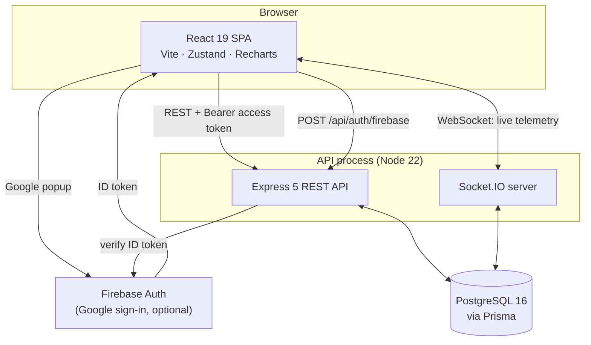

# Pulsara — Architecture

This document explains how Pulsara is built and, more importantly, **why** each
decision was made. It is kept current as the system changes; where something is
not yet implemented, that is stated rather than implied.

---

## 1. What Pulsara is

Pulsara is an infrastructure intelligence dashboard. It answers three questions
for an on-call engineer:

1. **Is the fleet healthy right now?** — host telemetry and service reachability.
2. **What changed recently?** — CI/CD deployments and their outcomes.
3. **What is broken and who owns it?** — incidents, severity and assignment.

### The design constraint that shapes everything else

A status board is only useful if it is trusted during an outage. That means a
single rule governs the whole codebase:

> **The UI must never show a value the system did not actually observe.**

An unreachable API must look different from a healthy fleet. A service with no
measurements must say so rather than display a plausible number. This rule is
why there is no fallback data anywhere in a runtime path, and why the seed
script bootstraps *configuration* (which services exist) but never
*observations* (how those services are doing).

---

## 2. System shape



The API is a single process that serves both HTTP and WebSocket traffic on one
port. Splitting them would mean two deployables, two TLS configurations and two
CORS policies for no benefit at this scale; Socket.IO's handshake is an ordinary
cross-origin HTTP request that upgrades in place, so it reuses the same origin
allowlist as REST.

---

## 3. Repository layout

```
backend/
  prisma/
    migrations/          Versioned, checked-in SQL migrations
    schema.prisma        Single source of truth for the data model
    seed.ts              Local bootstrap: first admin + service catalogue
  src/
    config/
      env.ts             Zod-validated environment; process exits if invalid
      constants.ts       Fixed values that are the same in every environment
    db/prisma.ts         One PrismaClient for the process
    lib/
      errors.ts          Typed error hierarchy
      http.ts            The single response envelope
      logger.ts          Structured (pino) logging with redaction
      validation.ts      Request parsing helpers
    middleware/
      auth.ts            Authentication (who are you?)
      authorize.ts       Authorization (may you?)
      errorHandler.ts    Terminal error handler
      notFound.ts        404 in the standard envelope
      requestLogger.ts   Request ids and correlated logging
    modules/             One folder per bounded context
      auth/  health/  services/  deployments/  incidents/
    realtime/io.ts       WebSocket transport
    app.ts               Middleware pipeline and route mounting
    server.ts            Listener, graceful shutdown, crash handling

frontend/
  src/
    config/env.ts        Zod-validated build-time environment
    shared/api/types.ts  The API contract, written down once
    shared/components/   Presentational primitives
    shared/store/        Zustand stores
    features/            One folder per screen
```

Modules are grouped by **domain**, not by technical layer. A change to how
incidents work touches one directory rather than four parallel `controllers/`,
`routes/`, `services/` and `types/` trees.

---

## 4. Configuration

Every environment-specific value is an environment variable, and the full set is
validated **once at startup** by a Zod schema (`backend/src/config/env.ts`,
`frontend/src/config/env.ts`). If anything is missing or malformed the API
prints one line per problem and exits non-zero before binding a port.

Why fail fast rather than fall back:

- A default secret is worse than a missing one. It ships to production, looks
  configured, and is public in the repository. The schema explicitly rejects the
  placeholder values that previously lived in this codebase.
- A silent `|| 'http://localhost:4000'` in a client bundle means a production
  build that lost a variable tries to reach the developer's laptop instead of
  failing.
- Cross-field rules are checked too: the access and refresh secrets must differ,
  and the three Firebase credentials must be supplied together or not at all.

Secrets never enter the repository. `.env.example` documents every variable with
its purpose; real values come from the platform's secret store.

---

## 5. Data model

PostgreSQL, accessed through Prisma. SQLite was dropped: the telemetry features
depend on time-ordered aggregates and composite indexes with sort direction that
SQLite cannot express, and shipping a different engine in development from the
one in production hides exactly the class of bug that matters here.

Schema changes are versioned SQL migrations checked into `prisma/migrations/`,
applied with `prisma migrate deploy`. The previous workflow used `prisma db
push`, which has no history and cannot be rolled back or reviewed.

Indexes are declared to match real access patterns rather than added per-column:
`Deployment` is always read newest-first filtered by status or repo, and
`Metric` is always read as "one metric family, one host, newest first".

---

## 6. Authentication and authorization

### Access token in memory, refresh token in an HttpOnly cookie

The access token is short-lived (15 minutes by default) and returned in the
response body for the client to hold in memory. The refresh token is long-lived
and set as an `HttpOnly` cookie scoped to `/api/auth`.

The split exists because a token readable by JavaScript is a token an XSS
payload can exfiltrate. Keeping the long-lived, high-value half out of reach of
script limits the blast radius of a successful injection to one short access
token window.

### Refresh token rotation with reuse detection

Refresh tokens are persisted (as SHA-256 digests, so a database disclosure
yields no usable sessions) and are **single-use**. Each refresh revokes the
presented token and issues a new one, linked into a chain.

If an already-rotated token is presented again, either an attacker replayed a
stolen token or the legitimate client retried — and the server cannot tell
which. The safe response is to assume compromise and revoke every session for
that user.

Two implementation details matter:

- The mass revocation runs **outside** the transaction that then throws. A write
  enrolled in a transaction that rejects is rolled back with it, which would
  silently undo the revocation the throw is meant to enforce.
- Rotation claims the token with a conditional update (`WHERE revokedAt IS
  NULL`), making it an atomic compare-and-swap. Without it, two concurrent
  refreshes with the same token would both mint live sessions.

### Passwords

Argon2id with OWASP's recommended parameters (19 MiB, 2 iterations, 1 lane),
pinned explicitly so a dependency upgrade cannot silently weaken every hash.
Failed logins for unknown accounts still run a verification against a dummy
digest, so response time does not reveal whether an address is registered.

### Roles

`ADMIN > MEMBER > VIEWER`, ranked rather than flat, so a route declares the
*minimum* role it requires. The first account in an empty deployment becomes
administrator; every account after that starts as `VIEWER` and must be promoted
deliberately.

---

## 7. HTTP contract

Every endpoint returns the same envelope:

```jsonc
{ "success": true,  "data": { }, "meta": { } }
{ "success": false, "error": { "code": "…", "message": "…", "requestId": "…" } }
```

`code` is a stable machine-readable string; `message` is for humans. Clients
branch on `success` and never have to guess a route's shape.

Errors are raised as typed exceptions and rendered in exactly one place. Express
5 forwards rejected handler promises to the error middleware automatically, so
handlers contain no `try`/`catch` boilerplate and cannot invent their own error
format. Stack traces are logged server-side and never serialised into a
response — the previous implementation returned `err.stack` to the client on
every failure, in every environment.

Every response carries an `x-request-id` that appears in both the error body and
the server log, so a user-reported failure maps to a log entry directly.

---

## 8. Observability and lifecycle

- **Logging**: pino, newline-delimited JSON, with authorization headers,
  cookies and password fields redacted at the logger rather than at each call
  site.
- **Health**: `/api/health` is liveness and touches no dependency;
  `/api/health/ready` is readiness and pings the database. They are separate
  because an orchestrator restarts on liveness failure but only removes from the
  load balancer on readiness failure — reporting a database blip as a liveness
  failure would restart every replica during a failover.
- **Shutdown**: `SIGTERM` closes the listener, drains WebSocket clients and the
  connection pool, with a timed backstop so a hung handler cannot block a
  rollout.

---

## 9. Implementation status

| Area | State |
| :--- | :--- |
| Configuration, validation, secrets hygiene | Implemented |
| PostgreSQL + versioned migrations | Implemented |
| Authentication, rotation, RBAC | Implemented |
| Error contract, logging, health, shutdown | Implemented |
| Host telemetry + service probing | **Not yet implemented** |
| Incident/alerting engine | **Not yet implemented** |
| GitHub Actions integration | **Not yet implemented** |
| Automated tests | **Not yet implemented** |
| Container images and CI | **Not yet implemented** |

Until the telemetry engine lands, `Service.uptime` and `Service.responseTime`
sit at their defaults and the dashboard shows them as such. That is deliberate:
a service with no measurements reports no measurements.
