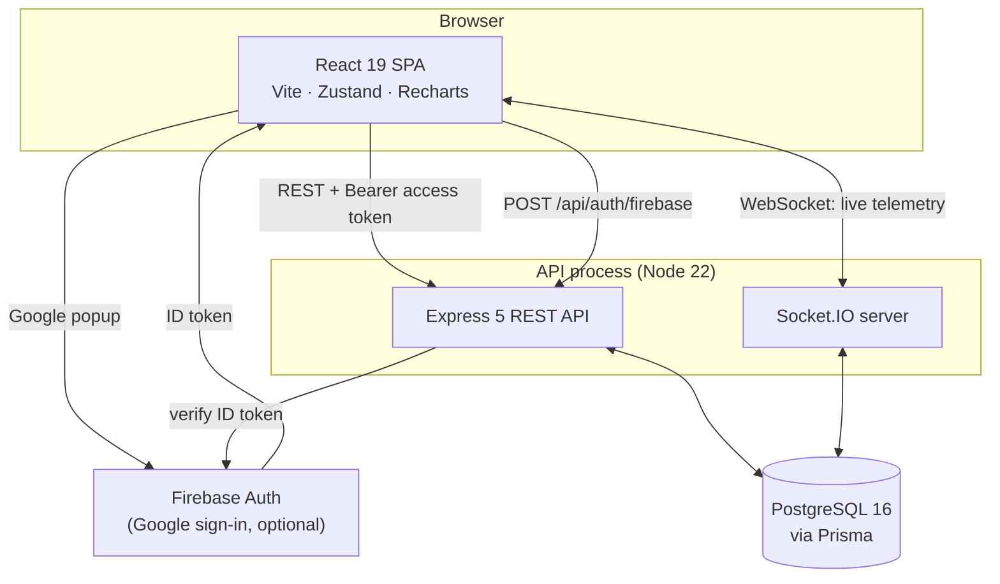

# Pulsara — Architecture

This document explains how Pulsara is built and, more importantly, **why** each
decision was made. It is kept current as the system changes; where something is
not yet implemented, that is stated rather than implied.

---

## 1. What Pulsara is

Pulsara is an infrastructure intelligence dashboard. It answers three questions
for an on-call engineer:

1. **Is the fleet healthy right now?** — host telemetry and service reachability.
2. **What changed recently?** — CI/CD deployments and their outcomes.
3. **What is broken and who owns it?** — incidents, severity and assignment.

### The design constraint that shapes everything else

A status board is only useful if it is trusted during an outage. That means a
single rule governs the whole codebase:

> **The UI must never show a value the system did not actually observe.**

An unreachable API must look different from a healthy fleet. A service with no
measurements must say so rather than display a plausible number. This rule is
why there is no fallback data anywhere in a runtime path, and why the seed
script bootstraps *configuration* (which services exist) but never
*observations* (how those services are doing).

---

## 2. System shape



The API is a single process that serves both HTTP and WebSocket traffic on one
port. Splitting them would mean two deployables, two TLS configurations and two
CORS policies for no benefit at this scale; Socket.IO's handshake is an ordinary
cross-origin HTTP request that upgrades in place, so it reuses the same origin
allowlist as REST.

---

## 3. Repository layout

```
backend/
  prisma/
    migrations/          Versioned, checked-in SQL migrations
    schema.prisma        Single source of truth for the data model
    seed.ts              Local bootstrap: first admin + service catalogue
  src/
    config/
      env.ts             Zod-validated environment; process exits if invalid
      constants.ts       Fixed values that are the same in every environment
    db/prisma.ts         One PrismaClient for the process
    lib/
      errors.ts          Typed error hierarchy
      http.ts            The single response envelope
      logger.ts          Structured (pino) logging with redaction
      validation.ts      Request parsing helpers
    middleware/
      auth.ts            Authentication (who are you?)
      authorize.ts       Authorization (may you?)
      errorHandler.ts    Terminal error handler
      notFound.ts        404 in the standard envelope
      requestLogger.ts   Request ids and correlated logging
    modules/             One folder per bounded context
      auth/                Sessions, passwords, federated sign-in, account
      users/               Administration, role grants, audit trail
      health/              Liveness and readiness
      services/            Catalogue and probe configuration
      telemetry/           Host collector, probe scheduler, retention, reads
      deployments/         Delivery history reads
      github/              GitHub client, webhook receiver, sync
      incidents/           Alerting engine, incident CRUD and timeline
    realtime/io.ts       Authenticated WebSocket transport and publisher
    app.ts               Middleware pipeline and route mounting
    server.ts            Listener, graceful shutdown, crash handling

frontend/
  src/
    config/env.ts        Zod-validated build-time environment
    shared/
      api/
        types.ts         The API contract, written down once
        client.ts        The only place a request is sent or a token is read
        useApi.ts        Loading/error/empty/loaded state for a read endpoint
        useRealtime.ts   One socket subscription, re-opened on token rotation
        socket.ts        Authenticated Socket.IO handshake
      components/        Presentational primitives and route guards
      store/             Zustand stores (session, toasts)
    app/Sidebar.tsx      Role-filtered navigation
    features/            One folder per screen
      auth/                Sign-in (password and Google)
      dashboard/           Summary tiles and open incidents
      infrastructure/      Telemetry chart and service health map
      pipelines/           GitHub Actions runs
      alerts/              Incident feed, detail drawer and timeline
      users/               Administration (ADMIN only)
      settings/            Profile, security, sessions, integrations
      notfound/            404 inside the app shell
```

Modules are grouped by **domain**, not by technical layer. A change to how
incidents work touches one directory rather than four parallel `controllers/`,
`routes/`, `services/` and `types/` trees.

---

## 4. Configuration

Every environment-specific value is an environment variable, and the full set is
validated **once at startup** by a Zod schema (`backend/src/config/env.ts`,
`frontend/src/config/env.ts`). If anything is missing or malformed the API
prints one line per problem and exits non-zero before binding a port.

Why fail fast rather than fall back:

- A default secret is worse than a missing one. It ships to production, looks
  configured, and is public in the repository. The schema explicitly rejects the
  placeholder values that previously lived in this codebase.
- A silent `|| 'http://localhost:4000'` in a client bundle means a production
  build that lost a variable tries to reach the developer's laptop instead of
  failing.
- Cross-field rules are checked too: the access and refresh secrets must differ,
  and the three Firebase credentials must be supplied together or not at all.

Secrets never enter the repository. `.env.example` documents every variable with
its purpose; real values come from the platform's secret store.

---

## 5. Data model

PostgreSQL, accessed through Prisma. SQLite was dropped: the telemetry features
depend on time-ordered aggregates and composite indexes with sort direction that
SQLite cannot express, and shipping a different engine in development from the
one in production hides exactly the class of bug that matters here.

Schema changes are versioned SQL migrations checked into `prisma/migrations/`,
applied with `prisma migrate deploy`. The previous workflow used `prisma db
push`, which has no history and cannot be rolled back or reviewed.

Indexes are declared to match real access patterns rather than added per-column:
`Deployment` is always read newest-first filtered by status or repo, and
`Metric` is always read as "one metric family, one host, newest first".

---

## 6. Authentication and authorization

### Access token in memory, refresh token in an HttpOnly cookie

The access token is short-lived (15 minutes by default) and returned in the
response body for the client to hold in memory. The refresh token is long-lived
and set as an `HttpOnly` cookie scoped to `/api/auth`.

The split exists because a token readable by JavaScript is a token an XSS
payload can exfiltrate. Keeping the long-lived, high-value half out of reach of
script limits the blast radius of a successful injection to one short access
token window.

### Refresh token rotation with reuse detection

Refresh tokens are persisted (as SHA-256 digests, so a database disclosure
yields no usable sessions) and are **single-use**. Each refresh revokes the
presented token and issues a new one, linked into a chain.

If an already-rotated token is presented again, either an attacker replayed a
stolen token or the legitimate client retried — and the server cannot tell
which. The safe response is to assume compromise and revoke every session for
that user.

Two implementation details matter:

- The mass revocation runs **outside** the transaction that then throws. A write
  enrolled in a transaction that rejects is rolled back with it, which would
  silently undo the revocation the throw is meant to enforce.
- Rotation claims the token with a conditional update (`WHERE revokedAt IS
  NULL`), making it an atomic compare-and-swap. Without it, two concurrent
  refreshes with the same token would both mint live sessions.

### Passwords

Argon2id with OWASP's recommended parameters (19 MiB, 2 iterations, 1 lane),
pinned explicitly so a dependency upgrade cannot silently weaken every hash.
Failed logins for unknown accounts still run a verification against a dummy
digest, so response time does not reveal whether an address is registered.

### Roles

`ADMIN > MEMBER > VIEWER`, ranked rather than flat, so a route declares the
*minimum* role it requires. The first account in an empty deployment becomes
administrator; every account after that starts as `VIEWER` and must be promoted
deliberately.

### Roles are checked against the database, not the token

`protect` establishes *who* the caller is from the signed token. `requireRole`
establishes *what they may do*, and it re-reads the role and active flag from
the database rather than trusting the token's claim.

Without that lookup, an administrator demoted thirty seconds ago keeps full
administrative power until their token expires — precisely the window during
which somebody's access is being revoked for a reason. The cost is one indexed
primary-key lookup, paid only on privileged routes.

The deliberate remaining gap: **read** access is still governed by the token's
claims, so a deactivated user can continue reading for at most one access-token
lifetime (15 minutes by default). Closing that would mean a database round trip
on every request. The trade-off is stated rather than hidden, and the knob to
turn is `ACCESS_TOKEN_TTL_SECONDS`; anything that mutates state, including every
`ADMIN` and `MEMBER` action, is already checked live.

### Nobody can lock everyone out

An administrator cannot demote or deactivate themselves, and the last active
administrator cannot be removed by anyone. Both are ways an environment ends up
with zero administrators and no path back short of editing the database by hand.

The last-administrator check is a read-then-write on a count, so its transaction
runs at `SERIALIZABLE`. Under the default `READ COMMITTED`, two administrators
demoting each other at the same instant would both read a count of two, both
pass the check, and both commit.

Deactivating an account revokes every one of its sessions immediately. Without
that, a removed account would keep working until its refresh token expired,
which is up to a week.

### The audit trail

`AuditLog` existed in the original schema and nothing ever wrote to it. It now
records the privileged actions that matter after an incident and that somebody
is most likely to want to deny having taken: role grants, deactivations,
password changes, and service and repository configuration changes.

Writes are fire-and-forget and failure-tolerant: losing an audit row is bad, but
refusing a legitimate administrative action because the audit insert hit a
constraint is worse. In a regulated environment the opposite choice is correct,
and `lib/audit.ts` documents itself as the one place to change it.


---

## 7. Telemetry: how a number gets onto the screen

This is the part the product exists for, so it is worth tracing end to end.

### Host metrics

A collector samples real operating-system counters through `systeminformation`
on a fixed interval, writes one `Metric` row per family, and publishes a
snapshot to connected clients.

Details that matter:

- **Priming.** `currentLoad` reports load *since boot* on its first call, and
  `networkStats` returns null rates until it has two observations to
  difference. One reading is taken and discarded at startup, so the first
  sample a user sees is a real interval measurement rather than a lifetime
  average.
- **Memory uses `active`, not `used`.** On Linux, `used` counts the page cache,
  which the kernel hands back on demand, so it sits near 100% on any healthy
  machine and would make the series meaningless.
- **Disk is the fullest mount, not an average.** One full volume is an outage
  even when the others are empty.
- **Load average is omitted on Windows.** Node returns a constant 0 there. A
  flat line at zero would read as "idle" rather than "not measured", so the
  family is simply absent.
- **Overrun protection.** A tick is skipped if the previous one is still
  running, so a slow disk enumeration cannot make ticks pile up.
- **Failures are contained.** A failed read is logged and the next tick tries
  again. Clients see a gap in the series, which is the truthful representation
  of a period nobody measured.

### Service probing

A scheduler wakes on a tick, selects the services whose own interval has
elapsed, and probes them with bounded concurrency. HTTP probes issue a real
`GET` and assert the status falls in the configured range; TCP probes complete
a real handshake.

- **`GET`, not `HEAD`.** Many services answer `HEAD` with 405 while being
  perfectly healthy.
- **The response body is drained.** Otherwise the socket is never released back
  to the agent, and a long-running scheduler slowly exhausts the pool.
- **Timeouts record `null` latency.** A timeout measures our patience, not the
  service's speed; recording it would drag the latency average toward the
  timeout value.
- **Bounded concurrency.** Opening every socket at once would inflate the very
  latencies the probes are trying to measure.
- **Targets are validated.** An operator-supplied address this server will
  connect to on a timer is a server-side request forgery primitive if accepted
  carelessly, so HTTP targets are restricted to `http`/`https` without embedded
  credentials, and TCP targets to `host:port`.

### Status is a state machine with hysteresis

A service is only declared `OFFLINE` after `SERVICE_FAILURE_THRESHOLD`
consecutive failures, and only recovers after `SERVICE_RECOVERY_THRESHOLD`
consecutive successes. Acting on a single result would make a one-off network
hiccup indistinguishable from a real outage, and would page somebody for both.

`MAINTENANCE` is never entered or left automatically. It is an operator's
declaration that alerts are expected, and the scheduler must not override it.

A newly registered service starts `DEGRADED`, not `ONLINE`: it has not been
checked yet, and claiming health that has not been observed is exactly the
failure this system exists to prevent.

The observation and the derived status are written in one transaction.
Separate statements would let a crash between them leave a status that no
stored result supports.

### Health figures are derived, never stored

`uptime` and `responseTime` used to be columns on `Service` whose only writer
was the seed script, so every service reported the number a literal in
`seed.ts` had assigned it.

They are now computed from `ProbeResult` at read time, in a single query
covering every service — the per-service version is invisible with six services
and pathological with six hundred. Uptime is successes over total in the
window; latency is reported as p50 *and* p95, because an average hides exactly
the tail that users feel.

**A service with no observations returns `null`, not `0`.** The client renders
that as an em dash. "0% uptime" and "never checked" mean very different things
at three in the morning.

If observation volume outgrows the aggregate, the scaling path is a rollup
table maintained by the scheduler, not a denormalised column updated in two
places that can drift from its source.

### Series are downsampled server-side

A 24-hour range at a 5-second interval is roughly 17,000 points per family:
more than a chart can draw and more than a browser should parse. `date_bin`
groups the range into at most `maxPoints` even buckets and averages within
each, so response size is bounded by the request rather than by the range. The
bucket width is returned in the response so the client can label its axis
honestly.

The chart does not bridge gaps (`connectNulls={false}`): a gap means a period
that was not measured, and drawing a line through it would invent data.

### Retention

Telemetry is append-only and grows without bound — roughly a million indexed
rows per host per month at the default interval. A sweep deletes past the
retention horizon in bounded batches, so each transaction stays short and never
blocks the collector writing to the same table. Probe results are kept longer
than host metrics because they are the evidence behind uptime figures and
incident timelines, which someone may need to audit after the fact.

### The WebSocket is authenticated

The socket server previously accepted every connection with no credential at
all, so anyone who could reach the port received a live feed of what was
presented as production infrastructure telemetry. The handshake now requires
the same access token as the REST API, supplied through the Socket.IO `auth`
payload rather than a query parameter, so it does not land in proxy logs or
browser history.

---

## 8. Alerting: from an observation to an incident

The probe scheduler emits a status transition; the alerting engine decides
whether that transition is worth waking somebody for. Every incident it opens is
backed by probe results a user can go and look at.

For comparison, the previous system's incidents were two rows written by the
seed script — "High latency on Background Workers" and "Database connection
drop" — describing services that did not exist. They never changed and never
resolved, because nothing was watching anything.

### Deduplication is enforced by the database, not by application logic

A flapping service produces a transition every probe interval. Naively opening
an incident per transition would produce hundreds of them during one outage,
which is how alerting systems get muted.

Each automated incident carries a `dedupeKey` identifying the *condition*
(`service-availability:<serviceId>`), and a partial unique index enforces the
invariant:

```sql
CREATE UNIQUE INDEX "Incident_open_dedupe_unique"
  ON "Incident" ("dedupeKey")
  WHERE "isOpen" AND "dedupeKey" IS NOT NULL;
```

The check-then-insert in application code is a race: two scheduler ticks can
both observe "no open incident" and both insert. The constraint makes the second
insert fail, and the engine reads that failure as "already open" — which is the
correct outcome, reached without a lock.

The index is partial on purpose. Resolved incidents must be able to share a
dedupe key with each other and with a new open one, because the same condition
legitimately recurs. `isOpen` is a stored column rather than a derivation of
`status` precisely because a partial index needs a concrete column to filter on;
the API derives it from status on every write so the two can never disagree.

### Severity escalates but never de-escalates

The dedupe key is keyed on the service alone, not on the service *and* its
state. A service sliding from `DEGRADED` to `OFFLINE` therefore escalates the
incident it already has rather than opening a second one for the same outage,
and the title is restated so a list view does not still read "is degraded" for a
service that is fully down.

Severity only ever rises while an incident is open. Downgrading a `CRITICAL`
outage because one probe happened to succeed would quietly drop it below
whatever threshold a human is watching, in the middle of the outage.

### Only what the engine opened, the engine may close

Recovery auto-resolves incidents with `source = AUTOMATED`. A manually raised
incident is left alone: a person may be tracking something the probe cannot see,
and closing their investigation because one endpoint answered 200 would be worse
than leaving it open.

Entering `MAINTENANCE` opens nothing — it is a planned action — but it does not
close anything either, because a service that was genuinely broken before the
window began is still broken.

### The timeline is the postmortem

An incident row shows only its current state. `IncidentEvent` records what
happened and when: opened, escalated, assigned, commented, resolved, reopened.
Every mutation writes its timeline entry in the same transaction as the change
itself, so the two cannot diverge — a timeline that is sometimes wrong is worth
less than no timeline at all.

### Alerting failures never stop monitoring

`handleServiceStatusChange` catches and logs rather than propagating. A bug in
alerting must not take down the probe loop that feeds it, because the
observations remain correct and useful even when the alerting on top of them
is not.

---

## 9. CI/CD: mirroring GitHub Actions

Deployments were previously five rows written by the seed script, with
`Math.random()` durations and stages named Build/Test/Deploy that corresponded
to nothing that had ever executed. Every row is now a real workflow run.

### Webhooks for freshness, polling for correctness

The two mechanisms are not redundant, they cover each other's blind spots:

- **Webhooks** deliver a run within seconds of it changing, but only cover what
  happens after the hook is installed, and a delivery can be missed while the
  service is redeploying.
- **Polling** replays recent history, so anything missed is recovered on the
  next sweep. It uses GitHub's ETag: a `304 Not Modified` is not charged against
  the rate limit, which makes a frequent poll nearly free.

Both paths write through the same upsert keyed on `(provider, externalId)`.
Webhook delivery is at-least-once and overlaps with polling, so the same run
arrives repeatedly and by more than one route; inserting rather than upserting
would produce duplicate pipeline rows for a single deployment.

### The webhook signature is the whole security boundary

The webhook endpoint is reachable by anyone on the internet. Without a valid
signature check, anyone could POST forged deployment records into the dashboard.

Two implementation details are load-bearing, and both are easy to get subtly
wrong:

1. **The digest is computed over the raw bytes.** The webhook route is mounted
   *before* `express.json()` with its own `express.raw()` parser. Once the JSON
   parser has consumed the stream the original bytes are gone, and
   re-serialising the parsed object does not reproduce them — key order, unicode
   escaping and whitespace all differ. Verifying a re-serialised body rejects
   valid deliveries, and the usual "fix" for that is to stop verifying. The
   handler asserts the body is a `Buffer` so that reordering the middleware
   cannot silently disable the check.
2. **The comparison is `timingSafeEqual`.** A `===` on strings returns as soon
   as it finds a differing byte, leaking how much of a guessed signature was
   correct and making the digest forgeable one byte at a time. Lengths are
   compared first, because `timingSafeEqual` throws on a length mismatch and
   that throw would itself be a side channel.

Unrecognised event types are acknowledged with 200 rather than rejected.
Replying 4xx to an event we simply do not handle would make GitHub retry it
forever and eventually disable the hook.

### Mapping two fields onto one

GitHub splits a run's outcome across `status` (queued, in_progress, completed)
and `conclusion` (null until it finishes). Collapsing them correctly is the
whole job of the mapper, and getting it wrong is how a dashboard shows a failed
deployment as green.

`action_required` and `neutral` are treated as failures: a run that finished
without doing its job is not a green deployment. Duration is null rather than
negative when timestamps disagree, which happens with clock skew across runners
and would otherwise render as a build that took minus four seconds.

### Empty is not the same as unconfigured

The deployment list returns `connectedRepositories`, `pollingConfigured` and
`webhookConfigured` alongside the rows. "No repository connected" and
"connected but nothing has run" are both an empty list, and only one of them is
something the user has to fix. A failed sync is stored on the connection as
`lastSyncError` so a revoked token is visible in the UI rather than presenting
as a repository that has gone quiet.

### Cost control

Only the first page of runs is fetched per sweep: Pulsara mirrors *recent*
delivery activity, and walking a repository's whole history on every sync would
spend the rate limit on data nobody is looking at. Connections are synced
sequentially, because they share one rate-limit budget and running them in
parallel only exhausts it faster. Jobs are fetched only for runs that have
actually started.

---

## 10. HTTP contract

Every endpoint returns the same envelope:

```jsonc
{ "success": true,  "data": { }, "meta": { } }
{ "success": false, "error": { "code": "…", "message": "…", "requestId": "…" } }
```

`code` is a stable machine-readable string; `message` is for humans. Clients
branch on `success` and never have to guess a route's shape.

Errors are raised as typed exceptions and rendered in exactly one place. Express
5 forwards rejected handler promises to the error middleware automatically, so
handlers contain no `try`/`catch` boilerplate and cannot invent their own error
format. Stack traces are logged server-side and never serialised into a
response — the previous implementation returned `err.stack` to the client on
every failure, in every environment.

Every response carries an `x-request-id` that appears in both the error body and
the server log, so a user-reported failure maps to a log entry directly.

---

## 11. The web client

The client is a Vite + React single-page app. Three decisions shape it.

### One place sends requests

`shared/api/client.ts` is the only module that knows the access token exists or
that `fetch` is being called. Screens use `useApi` for reads and `apiRequest`
for writes. This is not tidiness for its own sake: when a 401 comes back, the
client has to refresh the session and replay the request exactly once, and that
is impossible to get right if a dozen components each hold their own copy of the
token and call `fetch` directly — which is what they previously did.

Refresh is single-flight. Ten polling components hitting an expired token
produce ten 401s within the same tick; without a shared in-flight promise they
would trigger ten concurrent rotations, and rotation with reuse detection reads
concurrent rotations as a stolen token and revokes the whole family. The user
would be signed out for having too many charts open.

Two paths deliberately bypass the client: sign-in, which has no session to
refresh, and the WebSocket handshake, which authenticates once at connect time.
`useRealtime` re-opens the socket when the token rotates, because a connection
authenticated with an expired token keeps working until it drops and then fails
every reconnect attempt.

### Nothing is stored in `localStorage`

The access token lives in memory only, and the refresh token is an HttpOnly
cookie the JavaScript cannot read. A token in `localStorage` is readable by any
script the page ever loads; a token in a closure is not.

The cost is that a page reload starts with no token, so the app has a
three-state session: `bootstrapping`, `authenticated`, `anonymous`. It exchanges
the cookie for an access token before rendering any route, and shows a splash
while it does. Without that third state the router would see "no token" during
the first frame and bounce an authenticated user to the login screen on every
refresh.

### Absence is rendered as absence

Every screen distinguishes four states — loading, error, empty, loaded — and an
unmeasured value renders as an em dash, never as zero or a plausible-looking
default. The service map used to fall back to a hard-coded array of six
healthy-looking services when its request failed, which meant a dead API and a
healthy fleet looked identical. Fleet uptime averages only over services that
have actually been probed, because counting an unprobed service as 100% inflates
the figure with data that does not exist.

Empty states say what would fill them ("the alerting engine opens one
automatically when a monitored service stops responding") so that empty reads as
a working system with nothing to report rather than as a broken one.

---

## 12. Observability and lifecycle

- **Logging**: pino, newline-delimited JSON, with authorization headers,
  cookies and password fields redacted at the logger rather than at each call
  site.
- **Health**: `/api/health` is liveness and touches no dependency;
  `/api/health/ready` is readiness and pings the database. They are separate
  because an orchestrator restarts on liveness failure but only removes from the
  load balancer on readiness failure — reporting a database blip as a liveness
  failure would restart every replica during a failover.
- **Shutdown**: `SIGTERM` closes the listener, drains WebSocket clients and the
  connection pool, with a timed backstop so a hung handler cannot block a
  rollout.

---

## 13. Implementation status

| Area | State |
| :--- | :--- |
| Configuration, validation, secrets hygiene | Implemented |
| PostgreSQL + versioned migrations | Implemented |
| Authentication, rotation, RBAC | Implemented |
| Error contract, logging, health, shutdown | Implemented |
| Host telemetry collection | Implemented |
| Service probing and status state machine | Implemented |
| Derived uptime and latency percentiles | Implemented |
| Authenticated realtime stream | Implemented |
| Telemetry retention | Implemented |
| Incident/alerting engine | Implemented |
| GitHub Actions integration | Implemented |
| Web client on the real API | Implemented |
| Automated tests | **Not yet implemented** |
| Container images and CI | **Not yet implemented** |

Deployments and incidents stay empty until their sources exist. Those views show
empty states rather than placeholder rows, because an empty list is the truth
about a system with no CI integration configured.
