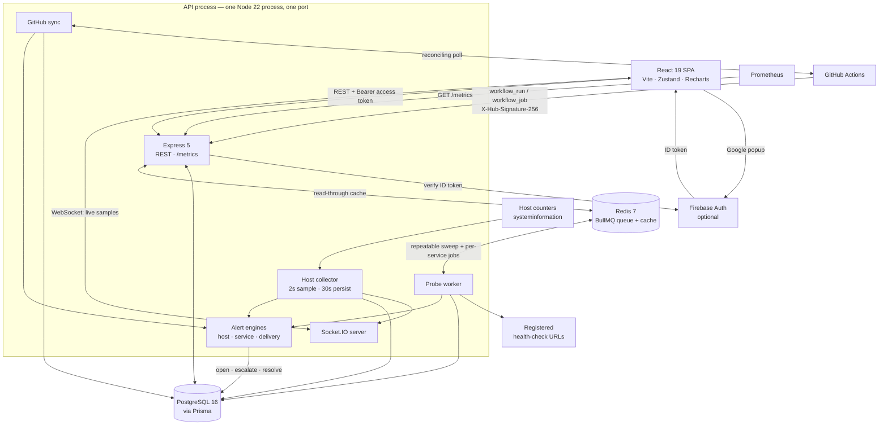
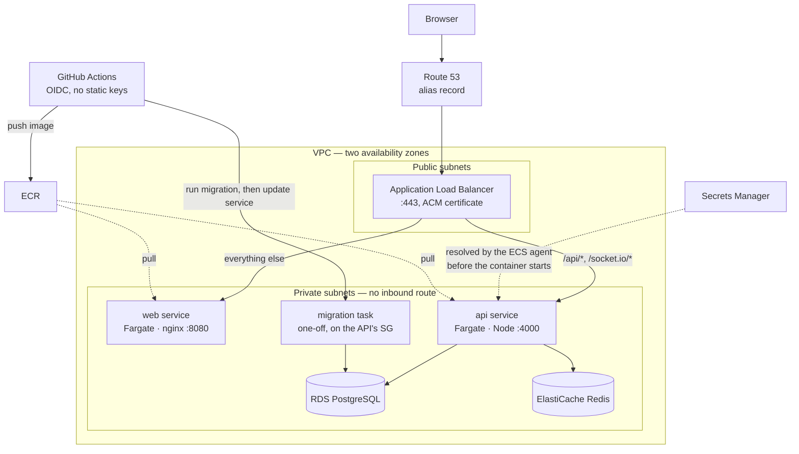

# Pulsara — Architecture

This document explains how Pulsara is built and, more importantly, **why** each
decision was made. It is kept current as the system changes; where something is
not yet implemented, that is stated rather than implied.

[README.md](./README.md) is how to run it. [RUNBOOK.md](./RUNBOOK.md) is what to
do when it breaks — a stalled probe worker, a GitHub App key to rotate, a bad
release to roll back. This document is the reasoning behind both, and the
argument you would have to make to change any of it.

---

## 1. What Pulsara is

Pulsara is an infrastructure intelligence dashboard. It answers three questions
for an on-call engineer:

1. **Is the fleet healthy right now?** — host telemetry and service reachability.
2. **What changed recently?** — CI/CD deployments and their outcomes.
3. **What is broken and who owns it?** — incidents, severity and assignment.

### The design constraint that shapes everything else

A status board is only useful if it is trusted during an outage. That means a
single rule governs the whole codebase:

> **The UI must never show a value the system did not actually observe.**

An unreachable API must look different from a healthy fleet. A service with no
measurements must say so rather than display a plausible number. This rule is
why there is no fallback data anywhere in a runtime path, and why the seed
script bootstraps *configuration* (which services exist) but never
*observations* (how those services are doing).

---

## 2. System shape

### The running system



The API is a single process serving both HTTP and WebSocket traffic on one port.
Splitting them would mean two deployables, two TLS configurations and two CORS
policies for no benefit at this scale; Socket.IO's handshake is an ordinary
cross-origin HTTP request that upgrades in place, so it reuses the same origin
allowlist as REST.

Redis is optional and the system is complete without it — probes run on an
in-process timer and reads go straight to PostgreSQL. That is correct for one
instance and wrong for several, because every replica would probe every service
and multiply load on the endpoints being measured.

### The deployed system



Public subnets hold exactly one thing. Both services, the database and the cache
have no inbound route from the internet, so the reachable surface of the whole
deployment is two ports on the load balancer. The two things that usually force
a hole in that — running migrations and getting a shell — have answers that do
not: migrations run as a one-off task on the API's own security group, and a
shell is ECS Exec.

Both halves are served from one hostname, split by path, which is what removes
cross-site cookies and CORS from production entirely.

---

## 3. Repository layout

```
backend/
  prisma/
    migrations/          Versioned, checked-in SQL migrations
    schema.prisma        Single source of truth for the data model
    seed.ts              Local bootstrap: first admin + service catalogue
  src/
    config/
      env.ts             Zod-validated environment; process exits if invalid
      constants.ts       Fixed values that are the same in every environment
    db/
      prisma.ts          One PrismaClient for the process
      redis.ts           Optional Redis, for the probe queue and the cache
    lib/
      cache.ts           Read-through cache with write invalidation
      errors.ts          Typed error hierarchy
      http.ts            The single response envelope
      logger.ts          Structured (pino) logging with redaction
      validation.ts      Request parsing helpers
    middleware/
      auth.ts            Authentication (who are you?)
      authorize.ts       Authorization (may you?)
      errorHandler.ts    Terminal error handler
      notFound.ts        404 in the standard envelope
      requestLogger.ts   Request ids and correlated logging
    modules/             One folder per bounded context
      auth/                Sessions, passwords, federated sign-in, account
      users/               Administration, role grants, audit trail
      health/              Liveness and readiness
      services/            Catalogue and probe configuration
      telemetry/           Host collector, probe scheduler, retention, reads
      metrics/             Prometheus exposition on GET /metrics
      deployments/         Delivery history reads
      github/              GitHub auth, client, webhook receiver, sync
      incidents/           Alerting engines, incident CRUD and timeline
    realtime/io.ts       Authenticated WebSocket transport and publisher
    app.ts               Middleware pipeline and route mounting
    server.ts            Listener, graceful shutdown, crash handling

frontend/
  src/
    config/env.ts        Zod-validated build-time environment
    shared/
      api/
        types.ts         The API contract, written down once
        client.ts        The only place a request is sent or a token is read
        useApi.ts        Loading/error/empty/loaded state for a read endpoint
        useRealtime.ts   One socket subscription, re-opened on token rotation
        socket.ts        Authenticated Socket.IO handshake
      components/        Presentational primitives and route guards
      store/             Zustand stores (session, toasts)
    app/Sidebar.tsx      Role-filtered navigation
    features/            One folder per screen
      auth/                Sign-in (password and Google)
      dashboard/           Summary tiles and open incidents
      infrastructure/      Telemetry chart and service health map
      pipelines/           GitHub Actions runs
      alerts/              Incident feed, detail drawer and timeline
      users/               Administration (ADMIN only)
      settings/            Profile, security, sessions, integrations
      notfound/            404 inside the app shell

infra/                    Terraform for the AWS account this deploys to
  network.tf              VPC, subnets, NAT, route tables, VPC endpoints
  security-groups.tf      Rules written against security groups, not CIDRs
  alb.tf                  Load balancer, target groups, path routing
  dns.tf                  ACM certificate, DNS validation, alias records
  ecs.tf                  Cluster and the two service instantiations
  modules/ecs-service/    Log group, task definition, service, autoscaling
  database.tf             RDS PostgreSQL
  cache.tf                ElastiCache Redis
  ecr.tf                  Both repositories and their lifecycle policies
  secrets.tf              Secrets Manager entries and the injection list
  iam.tf                  Task roles, the GitHub OIDC provider, deploy role
  outputs.tf              What the release workflow needs, in the shape it needs

e2e/                      Playwright: a real browser against the real stack
scripts/audit.mjs         Dependency gate, with a justified allowlist
.github/workflows/
  ci.yml                  Format, lint, audit, typecheck, test, build, publish
  deploy.yml              Build, migrate, deploy to ECS over OIDC
  infra.yml               terraform fmt, validate and plan on infra/ changes
backend/Dockerfile        Multi-stage; runs as the unprivileged `node` user
frontend/Dockerfile       Multi-stage; nginx-unprivileged on 8080
frontend/nginx.conf       SPA fallback and asset cache policy
docker-compose.yml        PostgreSQL and Redis; the stack behind `--profile app`
```

Modules are grouped by **domain**, not by technical layer. A change to how
incidents work touches one directory rather than four parallel `controllers/`,
`routes/`, `services/` and `types/` trees.

---

## 4. Configuration

Every environment-specific value is an environment variable, and the full set is
validated **once at startup** by a Zod schema (`backend/src/config/env.ts`,
`frontend/src/config/env.ts`). If anything is missing or malformed the API
prints one line per problem and exits non-zero before binding a port.

Why fail fast rather than fall back:

- A default secret is worse than a missing one. It ships to production, looks
  configured, and is public in the repository. The schema explicitly rejects the
  placeholder values that previously lived in this codebase.
- A silent `|| 'http://localhost:4000'` in a client bundle means a production
  build that lost a variable tries to reach the developer's laptop instead of
  failing.
- Cross-field rules are checked too: the access and refresh secrets must differ,
  and the three Firebase credentials must be supplied together or not at all.

Secrets never enter the repository. `.env.example` documents every variable with
its purpose; real values come from the platform's secret store.

---

## 5. Data model

PostgreSQL, accessed through Prisma. SQLite was dropped: the telemetry features
depend on time-ordered aggregates and composite indexes with sort direction that
SQLite cannot express, and shipping a different engine in development from the
one in production hides exactly the class of bug that matters here.

Schema changes are versioned SQL migrations checked into `prisma/migrations/`,
applied with `prisma migrate deploy`. The previous workflow used `prisma db
push`, which has no history and cannot be rolled back or reviewed.

Indexes are declared to match real access patterns rather than added per-column:
`Deployment` is always read newest-first filtered by status or repo, and
`Metric` is always read as "one metric family, one host, newest first".

---

## 6. Authentication and authorization

### Access token in memory, refresh token in an HttpOnly cookie

The access token is short-lived (15 minutes by default) and returned in the
response body for the client to hold in memory. The refresh token is long-lived
and set as an `HttpOnly` cookie scoped to `/api/auth`.

The split exists because a token readable by JavaScript is a token an XSS
payload can exfiltrate. Keeping the long-lived, high-value half out of reach of
script limits the blast radius of a successful injection to one short access
token window.

### Refresh token rotation with reuse detection

Refresh tokens are persisted (as SHA-256 digests, so a database disclosure
yields no usable sessions) and are **single-use**. Each refresh revokes the
presented token and issues a new one, linked into a chain.

If an already-rotated token is presented again, either an attacker replayed a
stolen token or the legitimate client retried — and the server cannot tell
which. The safe response is to assume compromise and revoke every session for
that user.

Two implementation details matter:

- The mass revocation runs **outside** the transaction that then throws. A write
  enrolled in a transaction that rejects is rolled back with it, which would
  silently undo the revocation the throw is meant to enforce.
- Rotation claims the token with a conditional update (`WHERE revokedAt IS
  NULL`), making it an atomic compare-and-swap. Without it, two concurrent
  refreshes with the same token would both mint live sessions.

### Passwords

Argon2id with OWASP's recommended parameters (19 MiB, 2 iterations, 1 lane),
pinned explicitly so a dependency upgrade cannot silently weaken every hash.
Failed logins for unknown accounts still run a verification against a dummy
digest, so response time does not reveal whether an address is registered.

### Roles

`ADMIN > MEMBER > VIEWER`, ranked rather than flat, so a route declares the
*minimum* role it requires. The first account in an empty deployment becomes
administrator; every account after that starts as `VIEWER` and must be promoted
deliberately.

### A token is checked against the account on every request

An access token is a snapshot of who somebody was when it was issued. That is
what makes it cheap to verify, and it is also the whole problem: between issuing
and expiry the account can be demoted, deactivated, or have every session
deliberately revoked, and a token that is merely well-signed knows none of it.

`protect` therefore reads three facts about the account on every authenticated
request — role, active flag, and the moment sessions were last revoked — and
uses them instead of the token's claims. The cost is one primary-key lookup,
served from Redis where it is configured and PostgreSQL where it is not, and
invalidated explicitly by every operation that changes one of the three.

This used to apply only to privileged routes. That left the guarantee uneven: a
demoted administrator was refused at `/api/users` and served everywhere else,
and "which routes are strict" is not a distinction anybody should have to hold
in their head.

### Signing out everywhere actually signs you out

Revoking refresh tokens ends a session's ability to *renew*. It does nothing to
an access token already in somebody's hands, which stays cryptographically valid
until it expires — so "sign out everywhere" left a stolen token working for the
rest of its lifetime, which is exactly the window the person clicking it is
trying to close.

`User.sessionsValidFrom` closes it. Revocation stamps the moment; `protect`
refuses any token issued before it. The same stamp is written when an account is
deactivated and when its password changes, because if the account was
compromised, the attacker's session is precisely what those actions are meant to
terminate.

The comparison uses a millisecond `iatMs` claim rather than JWT's own `iat`,
which has one-second resolution. That resolution cannot distinguish a token
issued just before a revocation from one issued just after inside the same
second, and both ways of rounding are wrong: rounding up refuses the token
somebody has just signed back in with, and rounding down honours the token the
revocation was meant to kill. Tokens minted before the claim existed fall back
to seconds, so a rollout does not sign everybody out.

### Roles are checked against the database, not the token

`protect` establishes *who* the caller is from the signed token. `requireRole`
establishes *what they may do*, and it re-reads the role and active flag from
the database rather than trusting the token's claim.

Without that lookup, an administrator demoted thirty seconds ago keeps full
administrative power until their token expires — precisely the window during
which somebody's access is being revoked for a reason. The cost is one indexed
primary-key lookup, paid only on privileged routes.

The deliberate remaining gap: **read** access is still governed by the token's
claims, so a deactivated user can continue reading for at most one access-token
lifetime (15 minutes by default). Closing that would mean a database round trip
on every request. The trade-off is stated rather than hidden, and the knob to
turn is `ACCESS_TOKEN_TTL_SECONDS`; anything that mutates state, including every
`ADMIN` and `MEMBER` action, is already checked live.

### Nobody can lock everyone out

An administrator cannot demote or deactivate themselves, and the last active
administrator cannot be removed by anyone. Both are ways an environment ends up
with zero administrators and no path back short of editing the database by hand.

The last-administrator check is a read-then-write on a count, so its transaction
runs at `SERIALIZABLE`. Under the default `READ COMMITTED`, two administrators
demoting each other at the same instant would both read a count of two, both
pass the check, and both commit.

Deactivating an account revokes every one of its sessions immediately. Without
that, a removed account would keep working until its refresh token expired,
which is up to a week.

### The audit trail

`AuditLog` existed in the original schema and nothing ever wrote to it. It now
records the privileged actions that matter after an incident and that somebody
is most likely to want to deny having taken: role grants, deactivations,
password changes, and service and repository configuration changes.

Writes are fire-and-forget and failure-tolerant: losing an audit row is bad, but
refusing a legitimate administrative action because the audit insert hit a
constraint is worse. In a regulated environment the opposite choice is correct,
and `lib/audit.ts` documents itself as the one place to change it.


---

## 7. Telemetry: how a number gets onto the screen

This is the part the product exists for, so it is worth tracing end to end.

### Host metrics

A collector samples real operating-system counters through `systeminformation`
on a fixed interval, writes one `Metric` row per family, and publishes a
snapshot to connected clients.

Details that matter:

- **Priming.** `currentLoad` reports load *since boot* on its first call, and
  `networkStats` returns null rates until it has two observations to
  difference. One reading is taken and discarded at startup, so the first
  sample a user sees is a real interval measurement rather than a lifetime
  average.
- **Memory uses `active`, not `used`.** On Linux, `used` counts the page cache,
  which the kernel hands back on demand, so it sits near 100% on any healthy
  machine and would make the series meaningless.
- **Disk is the fullest mount, not an average.** One full volume is an outage
  even when the others are empty.
- **Load average is omitted on Windows.** Node returns a constant 0 there. A
  flat line at zero would read as "idle" rather than "not measured", so the
  family is simply absent.
- **Overrun protection.** A tick is skipped if the previous one is still
  running, so a slow disk enumeration cannot make ticks pile up.
- **Failures are contained.** A failed read is logged and the next tick tries
  again. Clients see a gap in the series, which is the truthful representation
  of a period nobody measured.

### Service probing

A scheduler wakes on a tick, selects the services whose own interval has
elapsed, and probes them with bounded concurrency. HTTP probes issue a real
`GET` and assert the status falls in the configured range; TCP probes complete
a real handshake.

- **`GET`, not `HEAD`.** Many services answer `HEAD` with 405 while being
  perfectly healthy.
- **The response body is drained.** Otherwise the socket is never released back
  to the agent, and a long-running scheduler slowly exhausts the pool.
- **Timeouts record `null` latency.** A timeout measures our patience, not the
  service's speed; recording it would drag the latency average toward the
  timeout value.
- **Bounded concurrency.** Opening every socket at once would inflate the very
  latencies the probes are trying to measure.
- **Targets are validated.** An operator-supplied address this server will
  connect to on a timer is a server-side request forgery primitive if accepted
  carelessly, so HTTP targets are restricted to `http`/`https` without embedded
  credentials, and TCP targets to `host:port`.

### Probing is distributed when Redis is available

The in-process timer is correct for one instance and wrong for several. Every
replica would find the same due services and probe all of them: load on the
endpoints being measured multiplies by replica count, the extra contention
inflates the very latencies the probes exist to report, and interleaved writes
make the consecutive-result counters stop meaning what they say — "three
failures in a row" would be three replicas observing one failure each.

With `REDIS_URL` set, a BullMQ repeatable job does the sweeping and every
instance runs workers, so the sweep is singular across the fleet while the
probes themselves spread over it. BullMQ keeps one schedule per key however many
instances register it, which supplies the leader election without any of our
own. Each enqueued check carries a deterministic job id built from the service
and its last check time, so a sweep that somehow runs twice — a redeploy
overlapping a schedule, a clock jump — still produces one check per service.

Redis stays optional. Requiring a broker to run the application locally is a
cost paid by everyone who clones the repository, and what it buys is an
improvement on a working baseline rather than a prerequisite for one. What it
must never be is a *silent* dependency: if `REDIS_URL` is set and Redis is
unreachable, that is a configuration error and it is logged as one.

Completed jobs are kept only briefly. Every observation is already in
PostgreSQL, and retaining job history would make Redis a second, worse copy of
the same record.

### Status is a state machine with hysteresis

A service is only declared `OFFLINE` after `SERVICE_FAILURE_THRESHOLD`
consecutive failures, and only recovers after `SERVICE_RECOVERY_THRESHOLD`
consecutive successes. Acting on a single result would make a one-off network
hiccup indistinguishable from a real outage, and would page somebody for both.

`MAINTENANCE` is never entered or left automatically. It is an operator's
declaration that alerts are expected, and the scheduler must not override it.

A newly registered service starts `DEGRADED`, not `ONLINE`: it has not been
checked yet, and claiming health that has not been observed is exactly the
failure this system exists to prevent.

The observation and the derived status are written in one transaction.
Separate statements would let a crash between them leave a status that no
stored result supports.

### Health figures are derived, never stored

`uptime` and `responseTime` used to be columns on `Service` whose only writer
was the seed script, so every service reported the number a literal in
`seed.ts` had assigned it.

They are now computed from `ProbeResult` at read time, in a single query
covering every service — the per-service version is invisible with six services
and pathological with six hundred. Uptime is successes over total in the
window; latency is reported as p50 *and* p95, because an average hides exactly
the tail that users feel.

**A service with no observations returns `null`, not `0`.** The client renders
that as an em dash. "0% uptime" and "never checked" mean very different things
at three in the morning.

If observation volume outgrows the aggregate, the scaling path is a rollup
table maintained by the scheduler, not a denormalised column updated in two
places that can drift from its source.

### Series are downsampled server-side

A 24-hour range at a 5-second interval is roughly 17,000 points per family:
more than a chart can draw and more than a browser should parse. `date_bin`
groups the range into at most `maxPoints` even buckets and averages within
each, so response size is bounded by the request rather than by the range. The
bucket width is returned in the response so the client can label its axis
honestly.

The chart does not bridge gaps (`connectNulls={false}`): a gap means a period
that was not measured, and drawing a line through it would invent data.

### Sampling and persistence are on different clocks

Every sample is broadcast to connected clients, exposed on the scrape endpoint
and evaluated against the alert thresholds. Only the mean of each window reaches
the database.

The reason is arithmetic. At a two-second cadence, six metric families produce
roughly a quarter of a million rows a day per host — to draw a chart that
re-buckets them on read anyway. Writing the mean of a thirty-second window keeps
the same chart at a fifteenth of the write volume, and equal-length windows make
a mean of means equal to the mean, so the chart is not merely similar but
identical in expectation.

The obvious objection is that a mean hides a spike. It would, if alerting read
this table — which is exactly why alerting does not. Thresholds are evaluated
against raw samples as they are taken, so a four-second spike still opens an
incident even though no row will ever record it individually.

### The sample loop paces itself

Reads are scheduled `METRICS_SAMPLE_INTERVAL_MS` after the previous one
*returns*, not on a fixed-rate interval.

The cost of reading a counter is not a constant. On Linux these are procfs reads
and return in microseconds. On Windows `systeminformation` shells out:
`networkStats()` was measured at around four seconds on the development machine
and `fsSize()` at up to eight. A fixed two-second interval on that platform
queues a new read before the last has returned, forever, and the usual patch for
that — skip a tick while one is in flight — converts a real cadence into a
stream of warnings nobody can act on.

Self-pacing degrades honestly: the configured interval becomes the gap between
samples, a slow platform simply samples less often, and
`pulsara_host_sample_age_seconds` says by how much.

Disk is the exception even so. It is read at most once a minute and the value
reused, because a volume does not fill and drain between heartbeats, and paying
an eight-second syscall every two seconds to learn that would be absurd.

### Retention

Telemetry is append-only and grows without bound — roughly a million indexed
rows per host per month at the default interval. A sweep deletes past the
retention horizon in bounded batches, so each transaction stays short and never
blocks the collector writing to the same table. Probe results are kept longer
than host metrics because they are the evidence behind uptime figures and
incident timelines, which someone may need to audit after the fact.

### The WebSocket is authenticated

The socket server previously accepted every connection with no credential at
all, so anyone who could reach the port received a live feed of what was
presented as production infrastructure telemetry. The handshake now requires
the same access token as the REST API, supplied through the Socket.IO `auth`
payload rather than a query parameter, so it does not land in proxy logs or
browser history.

---

## 8. Alerting: from an observation to an incident

There are three sources of automated incidents, and one human one.

**Service reachability.** The probe scheduler emits a status transition and the
engine decides whether it is worth waking somebody for. Every incident it opens
is backed by probe results a user can go and look at.

**Host resource pressure.** Sampled CPU, memory and disk usage are compared
against configured thresholds on every sample. This is the question that gets
asked first when a service is technically up and behaving badly, and answering
it needs no probe at all.

**Delivery failure.** A workflow failing on the branch that ships is an
operational problem — nothing can be released until it is fixed — so it belongs
in the same feed as an outage rather than in a separate place people forget to
look.

**A person.** Operators genuinely raise incidents the monitoring cannot see: a
customer report, a bad configuration change, a dependency somebody else runs.
That path is ordinary validated CRUD, and what it produces is labelled MANUAL so
it reads differently from a machine's finding.

All three automated sources go through the same write path, in
`incident-store.ts`, because they agree on everything that matters: an incident
is identified by the condition rather than the occurrence, severity escalates
but never falls while it is open, a duplicate open is a race to absorb rather
than an error, and only what a machine opened may a machine close. Those are
four decisions somebody would otherwise re-make, differently, in the second
implementation — the de-escalation rule in particular looks like an obvious
improvement right up until you notice it drops an outage below the threshold a
human is watching, mid-outage.

### Delivery alerting reads state, it does not react to events

The condition is *"the latest run of this workflow on this branch is failing"*,
decided from stored history — not *"a failed run just arrived"*.

Reacting per delivery would be wrong three ways at once. Backfilling a
repository would open incidents for builds that failed and were fixed last week.
Webhook deliveries carry no ordering guarantee, so a late failure could reopen
what a later success had already cleared. And a re-run of the same broken build
would look like a second, separate problem. Deciding from the newest finished
run makes all three fall out correctly, and makes the engine idempotent:
evaluating twice changes nothing.

Two further judgements:

- **Only the default branch alerts.** A failing build on a feature branch is a
  developer mid-work. Opening an incident for every red pull-request run would
  bury the outages this feed exists to surface, and the predictable response —
  muting it — costs the real alerts too. Where the default branch is unknown the
  engine stays quiet rather than guessing `main`, which would be wrong for every
  repository still on `master`.
- **A cancelled run is not evidence either way.** It is usually somebody
  superseding their own push, so an open incident stays open and a healthy
  branch stays quiet.

Severity is HIGH on the first failure and CRITICAL once the branch has been red
for `DEPLOYMENT_FAILURE_ESCALATION_RUNS` runs in a row, counted from stored
history rather than from an in-memory counter — webhooks and the reconciling
poll both write here, the process restarts, and runs can arrive out of order.

The stored title and description are kept current as the failure count moves,
without appending to the timeline. That is a fix, not a design: the row was
originally restated only when severity rose, so an incident could go on saying
"failed for 1 run" and linking the *first* failure while the build had been red
six times. It was found by delivering real signed webhooks, not by reading the
code.

For comparison, the previous system's incidents were two rows written by the
seed script — "High latency on Background Workers" and "Database connection
drop" — describing services that did not exist. They never changed and never
resolved, because nothing was watching anything.

### Deduplication is enforced by the database, not by application logic

A flapping service produces a transition every probe interval. Naively opening
an incident per transition would produce hundreds of them during one outage,
which is how alerting systems get muted.

Each automated incident carries a `dedupeKey` identifying the *condition*
(`service-availability:<serviceId>`), and a partial unique index enforces the
invariant:

```sql
CREATE UNIQUE INDEX "Incident_open_dedupe_unique"
  ON "Incident" ("dedupeKey")
  WHERE "isOpen" AND "dedupeKey" IS NOT NULL;
```

The check-then-insert in application code is a race: two scheduler ticks can
both observe "no open incident" and both insert. The constraint makes the second
insert fail, and the engine reads that failure as "already open" — which is the
correct outcome, reached without a lock.

The index is partial on purpose. Resolved incidents must be able to share a
dedupe key with each other and with a new open one, because the same condition
legitimately recurs. `isOpen` is a stored column rather than a derivation of
`status` precisely because a partial index needs a concrete column to filter on;
the API derives it from status on every write so the two can never disagree.

### Severity escalates but never de-escalates

The dedupe key is keyed on the service alone, not on the service *and* its
state. A service sliding from `DEGRADED` to `OFFLINE` therefore escalates the
incident it already has rather than opening a second one for the same outage,
and the title is restated so a list view does not still read "is degraded" for a
service that is fully down.

Severity only ever rises while an incident is open. Downgrading a `CRITICAL`
outage because one probe happened to succeed would quietly drop it below
whatever threshold a human is watching, in the middle of the outage.

### Only what the engine opened, the engine may close

Recovery auto-resolves incidents with `source = AUTOMATED`. A manually raised
incident is left alone: a person may be tracking something the probe cannot see,
and closing their investigation because one endpoint answered 200 would be worse
than leaving it open.

Entering `MAINTENANCE` opens nothing — it is a planned action — but it does not
close anything either, because a service that was genuinely broken before the
window began is still broken.

### The timeline is the postmortem

An incident row shows only its current state. `IncidentEvent` records what
happened and when: opened, escalated, assigned, commented, resolved, reopened.
Every mutation writes its timeline entry in the same transaction as the change
itself, so the two cannot diverge — a timeline that is sometimes wrong is worth
less than no timeline at all.

### Thresholds are configuration, and hysteresis applies to them too

`CPU_ALERT_THRESHOLD_PERCENT` and its siblings are environment variables because
"90% CPU" means something entirely different on a batch worker than on a request
path. Disk defaults lower than the other two: a full volume is unrecoverable in
a way that a busy processor is not.

A breach must persist for `HOST_ALERT_SUSTAINED_SAMPLES` consecutive samples
before it opens anything, and clear for `HOST_ALERT_RECOVERY_SAMPLES` before it
resolves — the same shape as service probing, for the same reason. A single
sample above the line is a garbage-collection pause, a backup starting, or a
build running. Alerting on it is how an alerting system gets muted, and a muted
alerting system is worse than none because it is still believed.

Severity has two bands rather than a gradient: at the threshold an incident
opens HIGH, and at `HOST_ALERT_CRITICAL_PERCENT` it escalates to CRITICAL. An
engineer acts on "look at this soon" and "look at this now"; a five-level scale
computed from a percentage would imply a precision the measurement does not
have.

A metric that was not measured is skipped, never read as zero. Rendering a
missing disk figure as 0% would satisfy every recovery check and silently close
a real incident.

### The timeline and the audit trail are not the same record

Every incident mutation writes both, and they answer different questions for
different audiences.

The **timeline** (`IncidentEvent`) is the narrative of one incident: what
happened, in order, including everything the machines did. It is visible to
anybody who can see the incident, and it is what makes a postmortem possible.

The **audit trail** (`AuditLog`) is administrator-only, queryable by actor
across the whole system, and records only what a *person* chose to do — with the
before and after values, because "somebody edited this incident" is not
accountability and "this person moved it from CRITICAL to LOW at 03:14" is.

`AuditLog.userId` is not nullable, deliberately: the trail answers "who did
this", and an automated resolution has no who. Machine transitions therefore
appear on the timeline and not in the audit trail, which is why both exist.

Incident audit rows are written *inside the transaction that makes the change*,
using `recordAuditIn` rather than the fire-and-forget `recordAudit` used
elsewhere. The controller already needs that transaction so the timeline entry
and the state change commit together; once it exists the audit row rides along
for free, with the stronger guarantee that an audited action either happened and
was recorded or did neither.

### Alerting failures never stop monitoring

All three engines catch and log rather than propagating. A bug in alerting must not
take down the loop that feeds it, because the observations remain correct and
useful even when the alerting on top of them is not.

---

## 9. CI/CD: mirroring GitHub Actions

Deployments were previously five rows written by the seed script, with
`Math.random()` durations and stages named Build/Test/Deploy that corresponded
to nothing that had ever executed. Every row is now a real workflow run.

### A GitHub App, or a personal access token

Both are supported and exactly one may be configured; setting both is a startup
error, because which credential is talking to GitHub would otherwise depend on
code order rather than on configuration.

| | GitHub App | Fine-grained PAT |
| :--- | :--- | :--- |
| Identity | The application | A person |
| Survives an offboarding | Yes | No — dies with the account |
| Rate limit | 5,000/hour per installation, scaling with installation size | 5,000/hour shared with everything else that person's token does |
| Scope | Repositories the installation is granted, changeable without new credentials | Fixed at issue time; widening means minting a new token |
| Credential lifetime | Installation token expires in an hour and is renewed automatically | Up to a year, sitting in an environment variable the whole time |
| Revocation | Uninstall | Find and delete the right token |
| Setup cost | Create an App, install it, convert a PEM | Tick two boxes |

**A GitHub App is the right answer for anything deployed**, and not mainly for
the rate limit. It is that a token is somebody's personal credential: it carries
their access, appears in the audit log as them, and stops working the day they
leave — a class of outage that arrives weeks after the change that caused it
and looks like nothing at all until somebody asks why pipelines stopped
updating. An App is the service's own identity, which is what the service
actually needs.

A token remains supported because on a laptop the App flow is three steps of
ceremony to read a public repository, and making the development path harder
than it needs to be has its own cost.

The App path is two hops. A JWT signed with the App's private key (RS256, `iat`
backdated a minute against clock skew, `exp` inside GitHub's ten-minute ceiling)
proves *"I am this App"*. Exchanging it for an installation access token proves
*"and I am acting for this installation"* — and only the second can read a
repository. That token lasts an hour, so it is cached and renewed five minutes
early, behind a single-flight guard: GitHub invalidates nothing when it issues
another, so duplicate minting is waste that never announces itself.

The installation is discovered when the App has exactly one, and must be named
once it has more. Choosing arbitrarily between two would mirror the wrong
organisation's pipelines and look, from the dashboard, exactly like a repository
that had gone quiet.

### The monitored repository is configuration, not a setup step

`GITHUB_MONITORED_REPO` is registered and backfilled during startup. Without it
a correctly configured deployment still shows an empty pipelines page until
somebody remembers to POST a connection — which is indistinguishable from a
broken integration.

It runs once. Re-verifying and re-backfilling on every boot would spend rate
limit re-reading runs already stored, and would quietly resurrect a repository
an operator had deliberately disconnected. Failure is logged and swallowed: a
GitHub outage, a revoked credential or a renamed repository must not stop the
API from starting, because every other part of the product works without CI
data, and the connection's `lastSyncError` is where the reason belongs.

### Webhooks for freshness, polling for correctness

The two mechanisms are not redundant, they cover each other's blind spots:

- **Webhooks** deliver a run within seconds of it changing, but only cover what
  happens after the hook is installed, and a delivery can be missed while the
  service is redeploying.
- **Polling** replays recent history, so anything missed is recovered on the
  next sweep. It uses GitHub's ETag: a `304 Not Modified` is not charged against
  the rate limit, which makes a frequent poll nearly free.

Both paths write through the same upsert keyed on `(provider, externalId)`.
Webhook delivery is at-least-once and overlaps with polling, so the same run
arrives repeatedly and by more than one route; inserting rather than upserting
would produce duplicate pipeline rows for a single deployment.

### The webhook signature is the whole security boundary

The webhook endpoint is reachable by anyone on the internet. Without a valid
signature check, anyone could POST forged deployment records into the dashboard.

Two implementation details are load-bearing, and both are easy to get subtly
wrong:

1. **The digest is computed over the raw bytes.** The webhook route is mounted
   *before* `express.json()` with its own `express.raw()` parser. Once the JSON
   parser has consumed the stream the original bytes are gone, and
   re-serialising the parsed object does not reproduce them — key order, unicode
   escaping and whitespace all differ. Verifying a re-serialised body rejects
   valid deliveries, and the usual "fix" for that is to stop verifying. The
   handler asserts the body is a `Buffer` so that reordering the middleware
   cannot silently disable the check.
2. **The comparison is `timingSafeEqual`.** A `===` on strings returns as soon
   as it finds a differing byte, leaking how much of a guessed signature was
   correct and making the digest forgeable one byte at a time. Lengths are
   compared first, because `timingSafeEqual` throws on a length mismatch and
   that throw would itself be a side channel.

Unrecognised event types are acknowledged with 200 rather than rejected.
Replying 4xx to an event we simply do not handle would make GitHub retry it
forever and eventually disable the hook.

### Mapping two fields onto one

GitHub splits a run's outcome across `status` (queued, in_progress, completed)
and `conclusion` (null until it finishes). Collapsing them correctly is the
whole job of the mapper, and getting it wrong is how a dashboard shows a failed
deployment as green.

`action_required` and `neutral` are treated as failures: a run that finished
without doing its job is not a green deployment. Duration is null rather than
negative when timestamps disagree, which happens with clock skew across runners
and would otherwise render as a build that took minus four seconds.

### Empty is not the same as unconfigured

The deployment list returns `connectedRepositories`, `pollingConfigured` and
`webhookConfigured` alongside the rows. "No repository connected" and
"connected but nothing has run" are both an empty list, and only one of them is
something the user has to fix. A failed sync is stored on the connection as
`lastSyncError` so a revoked token is visible in the UI rather than presenting
as a repository that has gone quiet.

### Cost control

Only the first page of runs is fetched per sweep: Pulsara mirrors *recent*
delivery activity, and walking a repository's whole history on every sync would
spend the rate limit on data nobody is looking at. Connections are synced
sequentially, because they share one rate-limit budget and running them in
parallel only exhausts it faster. Jobs are fetched only for runs that have
actually started.

---

## 10. HTTP contract

Every endpoint returns the same envelope:

```jsonc
{ "success": true,  "data": { }, "meta": { } }
{ "success": false, "error": { "code": "…", "message": "…", "requestId": "…" } }
```

`code` is a stable machine-readable string; `message` is for humans. Clients
branch on `success` and never have to guess a route's shape.

Errors are raised as typed exceptions and rendered in exactly one place. Express
5 forwards rejected handler promises to the error middleware automatically, so
handlers contain no `try`/`catch` boilerplate and cannot invent their own error
format. Stack traces are logged server-side and never serialised into a
response — the previous implementation returned `err.stack` to the client on
every failure, in every environment.

Every response carries an `x-request-id` that appears in both the error body and
the server log, so a user-reported failure maps to a log entry directly.

---

## 11. The web client

The client is a Vite + React single-page app. Three decisions shape it.

### One place sends requests

`shared/api/client.ts` is the only module that knows the access token exists or
that `fetch` is being called. Screens use `useApi` for reads and `apiRequest`
for writes. This is not tidiness for its own sake: when a 401 comes back, the
client has to refresh the session and replay the request exactly once, and that
is impossible to get right if a dozen components each hold their own copy of the
token and call `fetch` directly — which is what they previously did.

Refresh is single-flight. Ten polling components hitting an expired token
produce ten 401s within the same tick; without a shared in-flight promise they
would trigger ten concurrent rotations, and rotation with reuse detection reads
concurrent rotations as a stolen token and revokes the whole family. The user
would be signed out for having too many charts open.

Two paths deliberately bypass the client: sign-in, which has no session to
refresh, and the WebSocket handshake, which authenticates once at connect time.
`useRealtime` re-opens the socket when the token rotates, because a connection
authenticated with an expired token keeps working until it drops and then fails
every reconnect attempt.

### Nothing is stored in `localStorage`

The access token lives in memory only, and the refresh token is an HttpOnly
cookie the JavaScript cannot read. A token in `localStorage` is readable by any
script the page ever loads; a token in a closure is not.

The cost is that a page reload starts with no token, so the app has a
three-state session: `bootstrapping`, `authenticated`, `anonymous`. It exchanges
the cookie for an access token before rendering any route, and shows a splash
while it does. Without that third state the router would see "no token" during
the first frame and bounce an authenticated user to the login screen on every
refresh.

### Absence is rendered as absence

Every screen distinguishes four states — loading, error, empty, loaded — and an
unmeasured value renders as an em dash, never as zero or a plausible-looking
default. The service map used to fall back to a hard-coded array of six
healthy-looking services when its request failed, which meant a dead API and a
healthy fleet looked identical. Fleet uptime averages only over services that
have actually been probed, because counting an unprobed service as 100% inflates
the figure with data that does not exist.

Empty states say what would fill them ("the alerting engine opens one
automatically when a monitored service stops responding") so that empty reads as
a working system with nothing to report rather than as a broken one.

---

## 12. Caching

Two endpoints do real work per request. `/api/services` runs a window function
over every stored probe result to derive uptime and latency percentiles;
`/api/deployments` joins stages onto a paginated run history. Every open
dashboard asks for both every thirty seconds, so without a cache the same
expensive answer is computed once per tab per interval.

The risk in caching a monitoring product is obvious: this whole system exists to
argue against showing numbers nobody measured, and a cache is a machine for
showing old ones. Three rules keep it honest.

**The TTL is short and bounds only unannounced staleness.** Ten seconds by
default. It is a shock absorber for repeated polling, not storage.

**Writes invalidate immediately.** A service changing state, a run landing, an
operator editing the catalogue — each clears the keys it affects, so the cache
is never the reason somebody sees an outage late.

A probe invalidates on a state *transition*, not on every observation. That is a
correction, and it came from watching a running system rather than from reading
the code: observing is the common case, a healthy fleet produces a result per
service per interval and changes nothing, and clearing the cache each time left
it empty within seconds of being filled. A cache with no hit rate is complexity
bought with nothing. What an observation actually moves is `lastCheckedAt` and a
set of aggregates windowed over twenty-four hours, and letting those sit for ten
seconds is not the staleness this system cares about — whether a service is up
is, and a transition is exactly that.

Invalidation happens **after** the write, never before. Clearing first leaves a
window in which a concurrent read repopulates from the pre-write state, and that
value then survives a full TTL — the one ordering mistake that turns a cache
into a source of wrong answers.

**A cache failure is a miss, never an error.** Redis down degrades to the
uncached behaviour, which is simply how the system runs without Redis at all. A
failed invalidation is logged and the write still succeeds: at most somebody
sees a stale figure for one TTL, which is a far smaller problem than refusing to
register a service.

Nothing user-specific is cached. Both endpoints return the same bytes to every
authenticated caller, which is what makes a shared key safe; the discriminator
includes the filters and the page, so two callers asking different questions
never share an answer.

Keys are fully qualified by the code that builds them rather than by ioredis's
`keyPrefix`. That option is applied to command arguments but not to the pattern
`SCAN` matches against, so a prefixed connection means keys are written with the
prefix, scanned for with a pattern that repeats it by hand, and then deleted
with the prefix applied a second time — an invalidation that silently deletes
nothing. It did, until a test caught it.

`UNLINK` rather than `DEL`, and `SCAN` rather than `KEYS`: reclaiming memory
moves to a background thread, and nothing blocks the server for the length of a
scan, which on a shared Redis would be somebody else's outage.

---

## 13. Observability and lifecycle

### Correlation reaches the lines that matter

Every request carries an id, echoed as `x-request-id` so a user can quote it,
and returned in the body of every error.

The id is also stamped on **every** log line the request produces, not only the
two `pino-http` writes itself. The lines worth finding during an incident are
the ones the application emits in between — a probe failing, an incident
opening, a cache read falling through — and those are written by services and
engines that never see a request object. Threading one through every module to
reach them would be a worse cure than the disease, so an `AsyncLocalStorage`
context carries it across every `await` and a pino `mixin` attaches it.

Work that outlives the request that started it — a scheduled probe, a background
sync — has no request to belong to, and its lines carry no id. That is correct
rather than unfortunate: inventing one would imply a caller that does not
exist.

### The system is scrapeable, not just viewable

`GET /metrics` serves Prometheus text exposition. A system that can only be
observed through its own UI cannot be alerted on by the tooling an organisation
already runs, cannot be graphed beside anything else, and stops being observable
at exactly the moment its own front end is the thing that has broken.

It sits at the root rather than under `/api`, because that is the path every
Prometheus installation already tries, and outside the JSON envelope, because a
scraper handed `{"success":true,"data":"..."}` simply fails to parse it. It is
also outside the session middleware: a scraper is not a user, holds no cookie,
cannot refresh a token, and would report the service down every time the signing
key rotated.

What it exposes, and why each is there:

| Family | Why |
| :--- | :--- |
| `pulsara_host_*_ratio`, `*_bytes_per_second` | The live sample, not the persisted mean |
| `pulsara_host_sample_age_seconds` | A stopped collector otherwise looks like a perfectly steady machine |
| `pulsara_host_alert_threshold_ratio` | So a dashboard draws the line the engine is actually using |
| `pulsara_service_up`, `_uptime_ratio`, `_latency_seconds` | Availability, with `state` as a label so maintenance is not an outage |
| `pulsara_service_last_check_age_seconds`, `_probe_interval_seconds` | A stalled prober is otherwise invisible — see below |
| `pulsara_incidents_open` | Emitted at zero for every severity, because an alert on an absent series never fires |
| `pulsara_deployments` | Delivery outcomes alongside runtime health |
| `process_*`, `nodejs_*` | Standard names, taken from `prom-client` rather than reinvented |

The service age pair deserves its own paragraph, because it exists for a
failure the rest of the exposition cannot express. If probing stalls — a lost
repeatable schedule, a saturated queue, a wedged process — nothing goes red. The
uptime and latency series keep reporting the last window they measured, the
dashboard keeps rendering them, and the alerting engines stay quiet, because
they open incidents from observations and an absent observation is not a failed
one. That silence is deliberate: treating "no data" as "down" would page the
whole fleet on every deployment. The cost of the choice is that a stopped prober
looks exactly like a healthy one, and the age is what pays it. The interval is
published beside it so an alert compares each service against its own schedule
rather than against a single threshold that is wrong for everything except the
median.

Conventions are followed rather than improvised, because getting them wrong is
what makes an exporter unpleasant to consume: base units throughout (seconds and
bytes, ratios in 0..1 rather than percentages — the internal model keeps
percentages because that is what a chart axis wants, and the conversion happens
in one place), the suffix states the unit, and label cardinality is bounded.
Nothing is labelled by incident id or request path; that is how an exporter takes
a Prometheus server down.

An unmeasured value is an **absent series**, never a zero. This is the same rule
the UI follows with its em dashes, and it matters more here: a zero would draw a
healthy flat line for a metric nobody collected.

`METRICS_SCRAPE_TOKEN` is optional. Unset is a legitimate configuration when the
port is reachable only from inside a cluster. Where it is exposed the token
matters, because the response names every monitored service, reports host
saturation and counts open incidents — enough to describe the shape and the
current weak points of a deployment to anyone who asks.


- **Logging**: pino, newline-delimited JSON, with authorization headers,
  cookies and password fields redacted at the logger rather than at each call
  site.
- **Health**: `/api/health` is liveness and touches no dependency;
  `/api/health/ready` is readiness and pings the database. They are separate
  because an orchestrator restarts on liveness failure but only removes from the
  load balancer on readiness failure — reporting a database blip as a liveness
  failure would restart every replica during a failover.
- **Shutdown**: `SIGTERM` closes the listener, drains WebSocket clients and the
  connection pool, with a timed backstop so a hung handler cannot block a
  rollout.

---

## 14. Testing

The suite is split by what it needs, not by what it covers.

`backend/tests/unit` exercises pure decision logic — the hysteresis state
machine, the GitHub status mapping, signature verification, token issuance,
password hashing. It needs nothing but Node and finishes in under a second, so
it is the fast loop and the first CI job.

`backend/tests/integration` drives the real Express app over HTTP against a real
PostgreSQL database. There is no mocked Prisma client anywhere, on purpose:
every guarantee in this system that is worth testing lives in the database. The
partial unique index that deduplicates incidents, the serializable transaction
that stops the last administrator being removed, the compare-and-swap that makes
refresh-token rotation safe under concurrency — a mocked client would assert
that the code calls the functions it calls, and would pass just as happily with
all three of those removed. Migrations are applied with `migrate deploy`, the
same command production runs, so a migration that only works when generated from
a live schema fails here rather than during a release.

Each case starts from an empty database. Sharing fixtures between cases produces
suites where one failure cascades into unrelated ones and where test order
quietly becomes part of the contract. The truncation that makes that possible is
also why the suite refuses to run against a database whose name does not end in
`_test`.

The tests define their own environment rather than inheriting `.env`. Vitest
loads `.env` into `process.env` before setup files run, so without this a
developer whose local CORS origin or rate limit differed would see assertions
fail for reasons unrelated to their change.

On the client, `src/shared/api/client.test.ts` is the one that earns its place
most clearly: it pins single-flight refresh, replay-exactly-once, and the rule
that a failed refresh — and only a failed refresh — ends the session. Getting
that wrong does not look like a bug, it looks like "the app randomly logs me
out". The component tests assert the product's central honesty rule: that an
unmeasured value renders as an em dash, and that a failed request renders as an
error rather than as a healthy fleet.

### The browser suite covers what neither side can

`e2e/` drives a real Chromium against a real API and a real database. The other
two suites each test one side of a boundary — Express against PostgreSQL with no
browser, React against a stubbed `fetch` with no server — and neither would
notice if the two sides disagreed. A refresh cookie the browser declines to
store, a CORS origin that does not match, a WebSocket handshake the client
authenticates differently from how the server expects: each passes every unit
test and fails a user.

Playwright starts both servers itself, against a database of its own that the
global setup creates, migrates and seeds through `prisma/seed.ts` — the same
bootstrap a developer runs, rather than a private arrangement that exists only
for the tests. Probing is switched off there deliberately, which puts the
catalogue in the state the original dashboard papered over: services registered,
nothing observed. The correct render is an em dash, and the suite says so.

The flow that matters most ends with a CPU figure that changes. Seeing it move
proves the whole path at once: a token held only in memory authenticated a
socket handshake, the server accepted it, and the collector published a genuine
`systeminformation` reading.

There is no Prisma client in that package. The generated client belongs to the
schema it came from, and a second copy would let a schema change leave the
browser suite talking to a client that no longer matches the database under it —
so the setup shells into the backend and uses its.

### Coverage is a floor, not a target

Both packages fail CI below a threshold set just under what the suite currently
reaches. That makes it a ratchet: a change that removes coverage fails, and a
change that adds it raises the bar for the next one. Set at an aspirational
figure instead, a threshold fails on unrelated work until somebody lowers it,
and a threshold lowered twice teaches everybody it means nothing.

The API sits at roughly 77% of lines and the client at roughly 44%, and the gap
is not an oversight. Most of the client is markup: the modules where a mistake is
possible — the request client, the route guard, the session store — are above
90%, while five list screens are largely JSX and are covered by the browser
suite instead. Chasing the number through that JSX would add assertions about
class names and produce a better percentage with no better software.

It is worth saying plainly what the figure is not. Coverage records that a line
ran, not that anything checked what it did. The suites it guards assert
behaviour against a real database and a real browser precisely because a
percentage cannot.

---

## 15. Packaging and delivery

### Images

Both images are multi-stage, so what ships contains neither the toolchain nor
the source. Every tool left in a production image is a tool an attacker who
lands inside it inherits.

The base is Debian slim rather than Alpine. Prisma's query engine and the argon2
native module both link against OpenSSL, and musl builds of those are the usual
source of an image that builds cleanly and then fails to start. Relatedly, the
build stage installs the `openssl` binary even though nothing in the build calls
it: Prisma selects its query engine by *detecting* the OpenSSL version at
generation time, and on a slim image with no openssl present that detection
silently falls back to a 1.1 engine which cannot start on the 3.0 runtime. That
failure appears only when the container is run, never when it is built, so it is
exactly the kind that reaches a registry.

The API runs as the unprivileged `node` user and the client is served by
unprivileged nginx on port 8080. Both declare a `HEALTHCHECK`, and the API's
targets liveness rather than readiness — readiness touches the database, and a
failover blip must not make the orchestrator restart every replica at once.

`.dockerignore` excludes `.env` in both packages. Without that line a local
secrets file is copied into a layer, where it survives every later deletion and
travels with the image to anyone who can pull it. On the client it would be
worse still: Vite would inline the values into JavaScript served to every
visitor.

### The client's API origin is a build argument

Vite inlines `VITE_*` at build time, so `VITE_API_URL` is a `--build-arg`, not a
runtime environment variable. An image built for staging therefore cannot be
repointed at production by changing an env var. That is a constraint, and it is
the honest one: pretending otherwise is how a client ends up talking to the
wrong API.

### Compose

`docker compose up -d` starts the backing services only — PostgreSQL and Redis
— because that is what a developer running `npm run dev` needs, and because the
default path must not fail on a clean checkout. The application containers sit
behind an `app` profile and read `backend/.env`, which is not in the repository.

Both publish on shifted ports, 5433 and 6380, rather than the defaults. A
developer with a native PostgreSQL or Redis already bound is common, and a
silent port clash produces a failure that points everywhere except at the cause.

Redis is there because two things use it: the probe queue, which makes the sweep
singular across replicas rather than multiplying probes by replica count, and
the read cache in front of the two endpoints that cost real work. It is capped
at 256 MB with `allkeys-lru`, because everything in it is a cache entry or a
transient job and nothing is a record of anything — an unbounded Redis that
fills starts refusing writes, and that would take the probe queue down with it.
It stays optional: without `REDIS_URL` the API probes on an in-process timer and
reads go straight to PostgreSQL, which is the correct behaviour for a single
instance.

### CI

Four jobs, in `.github/workflows/ci.yml`, on every push and every pull request.

**API** and **Web** each run format, lint, audit, typecheck, tests and build, in
that order — cheapest first, so an obvious failure is reported in seconds rather
than after a database has been migrated. The API job runs its integration suite
against PostgreSQL and Redis service containers, both with a health-command so
the first migration does not race the database's own start-up. It runs that
suite under coverage rather than plain, because the thresholds are a ratchet: a
change that removes coverage has to fail here, not be noticed a release later.

**End to end** installs all three packages, because Playwright starts the real
API and the real client itself, then runs Chromium against them. On failure, and
only on failure, it uploads the trace: a passing run should leave nothing
behind, and a trace is what makes a failure diagnosable without reproducing it.

**Images** builds both Dockerfiles on every run, so a broken Dockerfile fails
the pull request that caused it rather than the release three days later, and
pushes to GHCR only from the default branch. A pull request from a fork has a
read-only token; it must not be able to publish a tag that a deployment might
pull, and it does not even attempt the registry login, because a failure there
would fail the job for a reason unrelated to the change under review.

### Deployment

`.github/workflows/deploy.yml` runs on a push to `main`, and can be re-run by
hand — the recovery path when a release fails halfway, since pushing an empty
commit to re-trigger a workflow is not a rollback procedure.

**There is no AWS access key in this repository.** The workflow assumes an IAM
role through GitHub's OIDC provider: GitHub signs a short-lived token describing
the repository, ref and workflow that requested it, and the role's trust policy
decides whether to honour it. That trust policy is where a deployment is
actually restricted — to this repository, and to `ref:refs/heads/main` — and it
is why there is no static credential here to leak, to rotate, or to forget to
rotate. `id-token: write` is granted per job rather than workflow-wide, so the
token is minted only in the jobs that use it.

The order is the whole design:

1. **Build.** Both images, tagged with the commit SHA. Never `latest`: given a
   running task you should be able to name the commit that produced it.
2. **Migrate.** Register a new API task-definition revision pointing at the new
   image, then run `prisma migrate deploy` as a one-off ECS task *from that
   revision*. Same image, same secrets, same subnets as the thing about to serve
   traffic — a migration run from the runner with its own copy of the connection
   string is a second configuration to keep in step, and it is the one nobody
   notices has drifted. It also means the production database needs no public
   route: opening port 5432 to GitHub's shared runners so a CI step could reach
   it would be a far larger hole than it saves work.
3. **Deploy the API**, onto the revision the migration ran from, so the running
   code and the schema it expects were never two separate decisions.
4. **Deploy the client**, only after the API has stabilised. There is no point
   shipping a bundle that talks to an API which would not start.

Two details carry more weight than their size suggests. `aws ecs wait
tasks-stopped` reports only that the migration task *finished*; the job reads
the container's exit code afterwards, because a failed migration allowed to look
like a success is exactly how a service ends up deployed against a schema it
does not have. And each deployment waits for `services-stable` rather than going
green when ECS accepts the request — otherwise the workflow reports success
about an API that never passed a single health check.

The release concurrency group sets `cancel-in-progress: false`. That is the
opposite of the CI setting, and deliberately so: cancelling a run between
`migrate deploy` and `update-service` would leave the database ahead of every
container still serving.

Everything environment-specific — region, cluster, service and task-definition
names, subnets, security groups — is a repository variable, and the role ARN is
the single secret. The `production` GitHub environment gates the run, so a
release that is not allowed to proceed cannot read the credentials either.

### Fargate, rather than EC2 or EKS

The question is not which is most capable. It is which one's operational
surface a two-service system can justify.

| | ECS on Fargate | ECS on EC2 | EKS |
| :--- | :--- | :--- | :--- |
| Hosts to patch | None | Every instance, forever | Every node, plus the control plane's version |
| Standing cost before any workload | None | The instances, running or not | ~$73/month for the control plane alone |
| Upgrade cadence imposed on you | None | AMI refreshes | A Kubernetes minor roughly every four months, with a support window |
| Per-vCPU-hour price | Highest | Lowest | Node price plus the control plane |
| Network identity | Per task, awsvpc by default | Per task with awsvpc, per instance otherwise | Per pod, once the CNI and IRSA are configured |
| What you write | A task definition | A task definition, plus capacity management | Deployments, Services, Ingress, HPA, and the controllers behind them |

**EC2 is cheaper per vCPU and more expensive per engineer.** It brings capacity
planning, cluster autoscaling, AMI patching and a second class of thing that can
be unhealthy — an instance that is full, or draining, or running a kernel
somebody needs to replace. On a footprint of roughly two vCPU total, the saving
is a few tens of dollars a month against a standing operational obligation.
Fargate's premium buys the removal of an entire category of incident.

**EKS is the right answer to a problem this does not have.** It earns its
control-plane bill and its upgrade treadmill when there are many services, many
teams needing namespace-level isolation, or scheduling requirements ECS cannot
express — pod affinity, custom schedulers, operators that reconcile things ECS
has no concept of. Choosing it for two containers means adopting a platform, a
version-skew policy and a set of controllers to keep current, in exchange for
capabilities nothing here uses. That is the kind of decision that looks
impressive on a diagram and shows up later as an afternoon lost to a CNI
upgrade.

**What Fargate specifically buys this design.** Task-level `awsvpc` networking
is not a convenience here — it is the thing that makes the security-group rules
in §15 expressible at all. "The database accepts connections from the API tasks"
is a sentence only because each task has its own network interface and its own
security group. On EC2 without awsvpc the rule degrades to "from these
instances", which stays true when somebody schedules something else onto them.

**What it costs, honestly.** Roughly 20-30% more per vCPU-hour than the
equivalent EC2 capacity; no daemonsets and no host access, so anything wanting a
node-level agent needs a sidecar instead; task start-up measured in tens of
seconds rather than the milliseconds a warm host gives you; and no GPUs or large
local disks. None of those constrain this workload — but if the answer to "why
not EC2" were "there is no downside", the comparison would not have been done.

The decision is also cheap to revisit. The unit of deployment is a task
definition either way, so moving to EC2 capacity later is a capacity-provider
change and a cluster with instances in it — not a rewrite. Moving to EKS is a
rewrite, which is the asymmetry that settles it.

### Infrastructure as code

`infra/` is Terraform for the account the release workflow deploys into. It
exists for the same reason the environment schema does: an arrangement that
lives only in somebody's console clicks is an arrangement nobody can review, and
one that cannot be rebuilt after it is deleted.

**Public subnets hold exactly one thing.** The load balancer. Both services, the
database and the cache are in private subnets with no inbound route from the
internet, so the reachable surface of the entire deployment is two ports on the
ALB. That is affordable rather than merely aspirational because the two things
that would normally force a hole — running migrations and getting a shell —
both have answers that do not: migrations run as a one-off ECS task on the API's
own security group, and a shell is ECS Exec, authorised by IAM and logged in
CloudTrail, rather than an SSH host standing permanently in a public subnet.

**Every rule names a security group, not a CIDR.** "The database accepts
connections from the API tasks" stays true when somebody later puts something
else in that subnet; "the database accepts connections from 10.20.16.0/20" does
not. The data stores have no egress rules at all, which is correct — PostgreSQL
and Redis answer connections, they do not make them. The API's egress is
deliberately unrestricted, because service health checks probe whatever URL
somebody registered and that is the feature.

**One hostname, split by path.** `/api/*` and `/socket.io/*` go to the API,
everything else to the client. Serving both from one origin removes cross-site
cookies and CORS from production entirely: the refresh cookie is first-party, so
it needs no `SameSite=None`, and browsers tightening third-party cookie
behaviour get no say in whether sessions survive.

**Secrets are references, not values.** The task definition carries ARNs; the
ECS agent resolves them with the execution role before the container starts, so
no credential is in the task-definition JSON, in `describe-task-definition`
output, or in the console. The distinction that matters is between the secrets
Terraform generates — the database password, the two signing keys, the Redis
auth token, none of which exist outside this deployment — and the ones it
creates empty. The Firebase service account and the GitHub App key are issued by
somebody else, and a value that passes through Terraform is a value in the state
file and in every plan that ever touched it, so Terraform makes the container
and a person puts the value in.

**Two fields Terraform deliberately does not own.** `aws_ecs_service` ignores
changes to `task_definition` and `desired_count`. The release workflow registers
a revision per commit and the autoscaling policy sets the running count; without
those two lines, an apply triggered by an unrelated change would roll production
back to whatever image tag a variable happens to name and reset a scaled-out
fleet to its minimum. Declaring who owns a field is what stops two systems
fighting over it.

**The sticky-session admission.** Socket.IO opens with HTTP long-polling and
only then upgrades, so with several API tasks and no shared adapter the
handshake and the poll after it must reach the same one. The API target group is
therefore sticky. That is a workaround, not a design: the right fix is the
Socket.IO Redis adapter, the cache is already there, and it is a change to the
application rather than to a load-balancer setting.

**There is no apply job in CI.** `.github/workflows/infra.yml` runs `fmt`,
`validate` and `plan` on pull requests that touch `infra/`, and stops. Applying
this configuration creates IAM roles and attaches policies to them, which is
indistinguishable from administrator access — a role able to do it can grant
itself anything, and making one assumable by a workflow would put account
takeover one merge away. The plan is also not saved with `-out`: a plan file
contains the resource attributes the state does, including the generated
database password, and the rendered text redacts them only because Terraform
marks them sensitive.

The defaults are chosen for a portfolio deployment and say so: one NAT gateway
rather than one per zone, single-AZ RDS, on-demand Fargate rather than Spot.
`infra/README.md` tabulates each with what it costs and what it buys, because a
cost decision recorded as a bare value is a decision nobody can revisit.

---

## 16. Dependencies and advisories

`npm audit` runs in CI against **production** dependencies only, and fails on a
high or critical advisory that nobody has justified.

Both halves of that are deliberate. Run with no threshold, `npm audit` fails on
everything — advisories in build tooling that never ships, transitive ones with
no upstream fix — and a team turns it off within a week. Run at
`--audit-level=critical` it passes silently through exactly the findings
somebody should look at. Development dependencies are excluded because they are
not in the image; a vulnerability in a test runner is worth knowing about and is
not the same risk as one in the code serving requests.

The middle position is `scripts/audit-allowlist.json`, where excusing a finding
costs something: each entry states the path that reaches the code, why it is not
reachable here, what the fix would cost, and a date by which somebody looks
again. An expired entry fails the build exactly as an unreviewed advisory does,
so an allowlist cannot quietly become permanent.

Two entries stand today, both unreachable:

- **deepmerge-ts**, reached through Prisma's config loader, which merges
  `prisma.config.ts` — a file in this repository. The input is never
  attacker-controlled and the loader does not run on a request path. The fix
  needs a major that `@prisma/config` has not taken.
- **uuid**, reached through the Firestore and Cloud Storage clients inside
  `firebase-admin`. Pulsara uses exactly one function from that package,
  `verifyIdToken`; those clients are never constructed, and the advisory
  additionally requires a `buf` argument nothing here passes.

Everything else `npm audit` reported was fixed by upgrading in place — including
high-severity denial-of-service advisories in `ws` and `socket.io-parser`, which
*are* on the request path, and a set in `react-router`.

Dependabot proposes updates weekly, grouping patch and minor into one pull
request per package so CI runs once and a reviewer reads one diff. Majors stay
separate, because each is a decision — the two advisories above are exactly the
kind of call a person should make rather than a bot.

---

## 17. Implementation status

| Area | State |
| :--- | :--- |
| Configuration, validation, secrets hygiene | Implemented |
| PostgreSQL + versioned migrations | Implemented |
| Authentication, rotation, RBAC | Implemented |
| Error contract, logging, health, shutdown | Implemented |
| Host telemetry collection | Implemented |
| Service probing and status state machine | Implemented |
| Derived uptime and latency percentiles | Implemented |
| Authenticated realtime stream | Implemented |
| Telemetry retention | Implemented |
| Incident/alerting engine | Implemented |
| GitHub Actions integration | Implemented |
| Web client on the real API | Implemented |
| Prometheus exposition | Implemented |
| Distributed probe queue and read cache | Implemented |
| Session revocation enforced on every request | Implemented |
| Dependency audit gate | Implemented |
| Automated tests | Implemented |
| Container images and CI | Implemented |
| Deployment pipeline (ECR, migrations, ECS) | Written, **not verified** |
| Infrastructure as code (Terraform) | Written and validated, **not applied** |
| Google sign-in verified against a live Firebase project | **Not verified** |
| GitHub polling verified against a live repository | **Not verified** |

Deployments and incidents stay empty until their sources exist. Those views show
empty states rather than placeholder rows, because an empty list is the truth
about a system with no CI integration configured.

The last three rows are the honest ones.

Firebase sign-in and GitHub polling are both implemented and covered by tests
that stub exactly one function each — Firebase's token verification and GitHub's
HTTP client — so everything the application itself does is exercised. Neither
has been run against a real Firebase project or a real GitHub token, because
this repository has no credentials for either.

`deploy.yml` and `infra/` are in the same position, and more so. The workflow's
YAML parses and the actions it calls are current major versions; the Terraform
formats, initialises and validates against the real AWS provider, and CI checks
all three on every change. But no run of either has happened, because that needs
an AWS account, and `terraform validate` proves a configuration is internally
consistent, not that AWS will accept it — a quota, an unsupported instance class
in a region, an IAM condition key that does not apply to a service, none of
those show up until an apply.

So: read them as a reviewable design for a release and the account it runs in,
not as something anybody has watched go green. Saying "works" of something
nobody has watched work would be the same species of claim this project was
built to remove.
