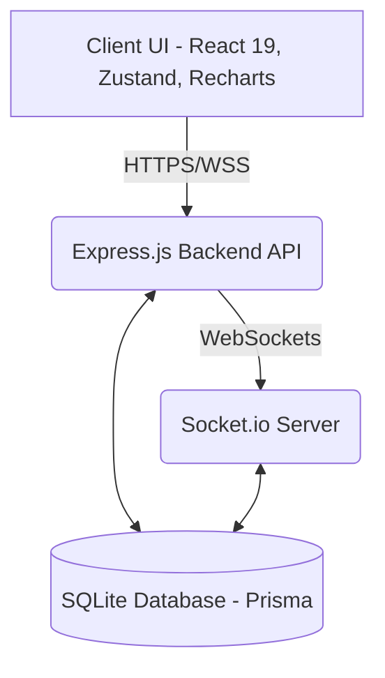

# Pulsara: Real-Time DevOps & Infrastructure Dashboard 🚀

Pulsara is a startup-ready, production-grade DevOps monitoring dashboard. It consolidates real-time host telemetry (CPU, memory, and network), active CI/CD deployment pipelines, microservices health states, and incident feeds into a single dark-themed glassmorphic interface.

The application leverages a hybrid architecture combining a local Node.js + Express + Prisma (SQLite) stack with Firebase Google OAuth for client authentication, achieving a highly secure, offline-first local experience.

---

## 🌟 Features

- **Real-Time Metrics:** Live updates for CPU, memory, and network usage with sparkline graphs and dynamic telemetry.
- **Glassmorphism UI:** Built with Tailwind CSS and React 19, following dark-mode best practices for engineering dashboards.
- **CI/CD Feed:** Live pipeline monitoring with simulated status rings and step-level pills.
- **Alerts & Incidents Feed:** Immediate, color-coded severity alerts (CRITICAL, HIGH, MEDIUM) to track system errors.
- **Role-Based Auth:** Secure Express backend with Firebase Google OAuth and custom JSON Web Tokens (JWT).
- **WebSockets:** Powered by Socket.io for instantaneous dashboard pushes (no polling).

---

## 📊 System Architecture & Data Flow



### Technical Stack Details
- **Frontend:** React 19, Vite, Zustand (Auth state persistence), Tailwind CSS (Glassmorphism layout), Recharts (Live telemetry graphs), Lucide icons.
- **Backend:** Express, Node.js, TypeScript (via `tsx` engine), Socket.io (WebSocket event stream), Winston (Structured Logging).
- **Database:** SQLite managed via Prisma Client (allowing rapid offline testing without Docker requirements).

---

## 🛠️ Prerequisites

- **Node.js**: v20 or higher
- **npm** or **yarn** package manager

---

## 🚀 Setup & Installation

### Option 1: Docker (Recommended)

1. Clone the repository.
2. Ensure Docker daemon is running.
3. Run the following command in the root folder:
   ```bash
   docker-compose up --build -d
   ```
4. Access the UI at `http://localhost:80` and the API at `http://localhost:4000`.

### Option 2: Manual Local Setup (SQLite-powered)

Follow these steps to spin up the backend and frontend services locally.

#### 1. Database & Backend Setup

Navigate to the `backend` directory:
```bash
cd backend
```

Install the backend dependencies:
```bash
npm install
```

Configure your environment variables. Copy the `.env.example` file (ensure `DATABASE_URL` is set to `file:./dev.db`):
```bash
cp .env.example .env
```

Sync your Prisma schema and generate database models:
```bash
npx prisma generate
npx prisma db push
```

Populate mock services, pipelines, and incidents:
```bash
npx prisma db seed
```

Start the backend server:
```bash
npm run dev
```
The server will start on [http://localhost:4000](http://localhost:4000).

---

#### 2. Frontend Setup

In a new terminal window, navigate to the `frontend` directory:
```bash
cd frontend
```

Install the frontend dependencies:
```bash
npm install
```

Start the frontend development server:
```bash
npm run dev
```
Access the client dashboard at [http://localhost:5173](http://localhost:5173).

---

## 🔐 Environment Variables

### Backend (`backend/.env`)

| Variable | Description | Example |
| :--- | :--- | :--- |
| `PORT` | Node server listening port | `4000` |
| `DATABASE_URL` | Prisma DB location | `file:./dev.db` |
| `JWT_SECRET` | Secret token signing key | `your_jwt_secret` |
| `REFRESH_SECRET` | Secret token refresh key | `your_refresh_secret` |
| `CORS_ORIGIN` | Allowed Client Origin URL | `http://localhost:5173` |

### Frontend (`frontend/.env`)

| Variable | Description | Example |
| :--- | :--- | :--- |
| `VITE_API_URL` | Backend URL for API & Sockets | `http://localhost:4000` |

---

## 🕹️ Demo Credentials

To bypass the DB setup initially and easily test the UI, use the mock user credentials built into the controller:

- **Email:** `admin@pulsara.dev`
- **Password:** `password`

---

## 🧪 Testing

Run test suites for the frontend and backend using:
```bash
# Backend
cd backend && npm run test

# Frontend
cd frontend && npm run test
```
